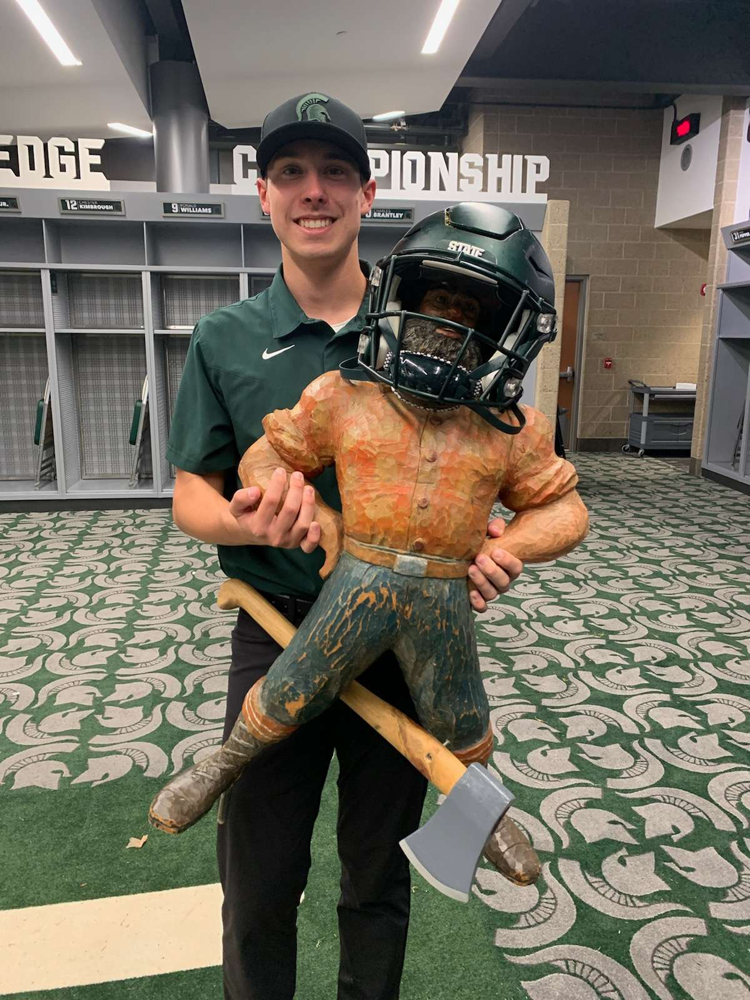
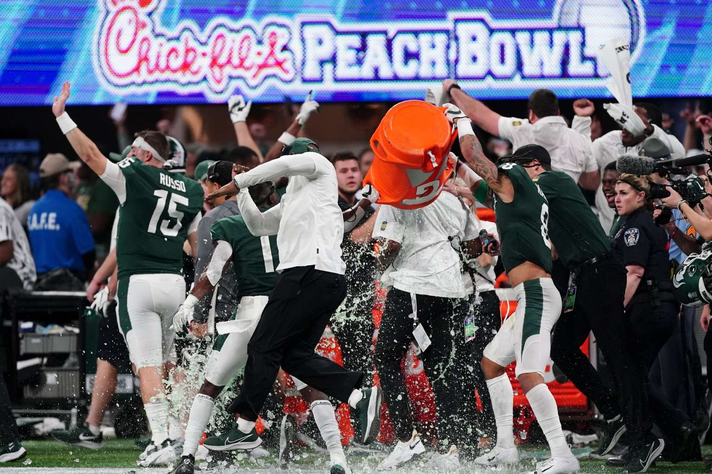

My path to baseball analytics has been nonlinear, but each step has shaped how I approach performance questions. Working in biomechanics taught me how to measure what matters. Supporting a Power 5 football program taught me how to translate interdepartmental needs across complex organizations. Independent research taught me how to ask better questions with data.

---

## Biomechanics & Performance Science

**Kistler Instrument Corp.** | 2022 - 2026

I spent nearly three years at Kistler supporting force plate measurement systems.
My role as Application Specialist for Biomechanics gave me direct exposure to how elite sport organizations integrate measurement technology into their workflows. I worked with MLB, NBA, NHL, and NFL teams, as well as university research institutions and elite-level performance facilities. As the sole executor of North American operations, the job required true end-to-end understanding of application design, system implementation, and full-scope acquisition optimization.

A few highlights:

- **Sport-specific system development**: Led projects designing instrumented pitcher's mounds and batter's boxes, working through the engineering and measurement challenges unique to baseball applications.
- **Motion capture integration**: Diagnosed and resolved interface issues between force plates and optical tracking systems- a common pain point when organizations try to synchronize kinetic and kinematic data.
- **Performance testing workflows**: Helped organizations design and troubleshoot testing protocols, with emphasis on data quality and repeatability.

This work gave me firsthand understanding of the gap between "having data" and "having useful data." Measurement systems are only as good as the workflows around them.

---

## Learning How Organizations Work

**Michigan State University Football** | 2018 - 2021

  
  
Paul Bunyan Trophy, 2021

Before Kistler, I spent four years earning my Applied Engineering Sciences degree and working as a student equipment manager for Michigan State Football, finishing as Head Student Manager in my final season. This experience shaped how I think about working within complex organizations more than any classroom or internship.

A Power 5 football program is a large, complex organization. On any given day, I coordinated across coaching staff, strength and conditioning, athletic training, nutrition, operations, and video- each with their own priorities, terminology, and constraints. My job was to make sure nothing fell through the cracks.

As Head Student Manager, I served as an on-field assistant to the head coach during practices and was responsible for leading the student staff. The role required anticipating needs before they became problems, communicating clearly across departments, and maintaining composure when things didn't go to plan- which, in college athletics, is most of the time.

What I took from this experience:

- **Cross-functional communication**: Learning to translate between departments with different priorities taught me that information only matters if it reaches the right people in a form they can use. 
- **Operating in high-pressure environments**: Gamedays and practice periods don't allow for hesitation. As the man on the microphone directing traffic every practice, I learned to be decisive and get comfortable with sudden change. In particular, this responsibility forced me to find a clear, confident voice and move on from mistakes immediately- because there's no hiding when the whole program is relying on you for direction.
- **Understanding organizational dynamics**: Every department in a football program believes their work is central to winning. Learning to navigate those dynamics- supporting everyone's goals without creating friction- is a skill that is applicable to any high level organization, athletics or otherwise.

I worked 4 seasons for the Spartans and had the opportunity to support teams that played in the Redbox Bowl (2018), Pinstripe Bowl (2019), and Peach Bowl (2021).

 

    
    
Peach Bowl, 2021 - Dodging the Gatorade bath

  

---

## Independent Research

Since 2022, I've maintained an independent focus on baseball analytics, primarily using publicly available data from Statcast and FanGraphs. This work is self-directed; I pursue questions that interest me and build the technical skills needed to answer them.

My research interests include:

- **Swing mechanics and offensive output**: Evaluating how swing speed distributions, contact point proxies, and batted-ball tendencies relate to performance changes over time
- **Rookie evaluation**: Estimating prospective WAR production within debut seasons, with emphasis on identifying which early-season indicators are meaningful versus noisy
- **Biomechanical variability**: Exploring public datasets like Driveline's OpenBiomechanics Project to understand pitch-to-pitch consistency and its relationship to velocity and command

I treat this site as a working archive- a place to document analyses, share methodology, and demonstrate how I think through problems. Selected projects are available on the [Projects](/projects/) page.

---

<a href="2026 Baseball Resume - Final.pdf" download class="btn btn-primary">
Download Resume (PDF)
</a>

---

## Education & Memberships

**Michigan State University** | Bachelor of Engineering, Applied Engineering Sciences | December 2021
- Concentration in Supply Chain Management

**Professional Memberships**
- Society for American Baseball Research (SABR)
- American Baseball Biomechanics Society (ABBS)

---

## Technical Skills

| Category | Tools & Methods |
|----------|-----------------|
| Analytics | Python, R, SQL |
| Biomechanics | Force plate systems, motion capture integration, performance testing protocol design |
| Data | Statcast, FanGraphs, Driveline OpenBiomechanics |

