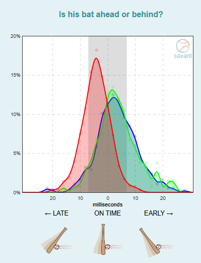
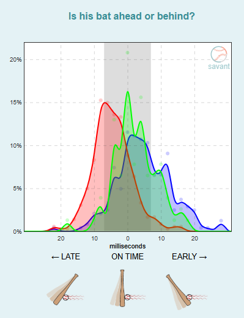
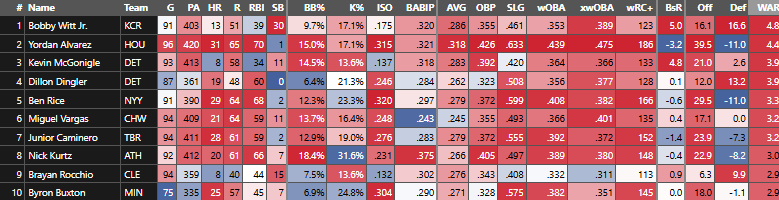
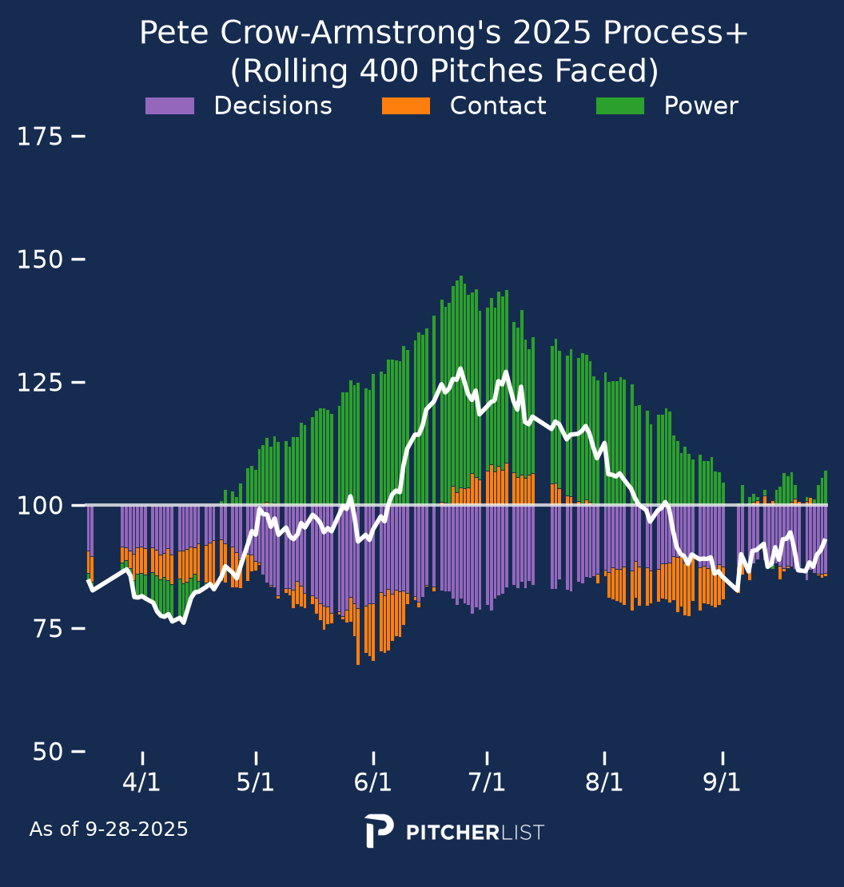
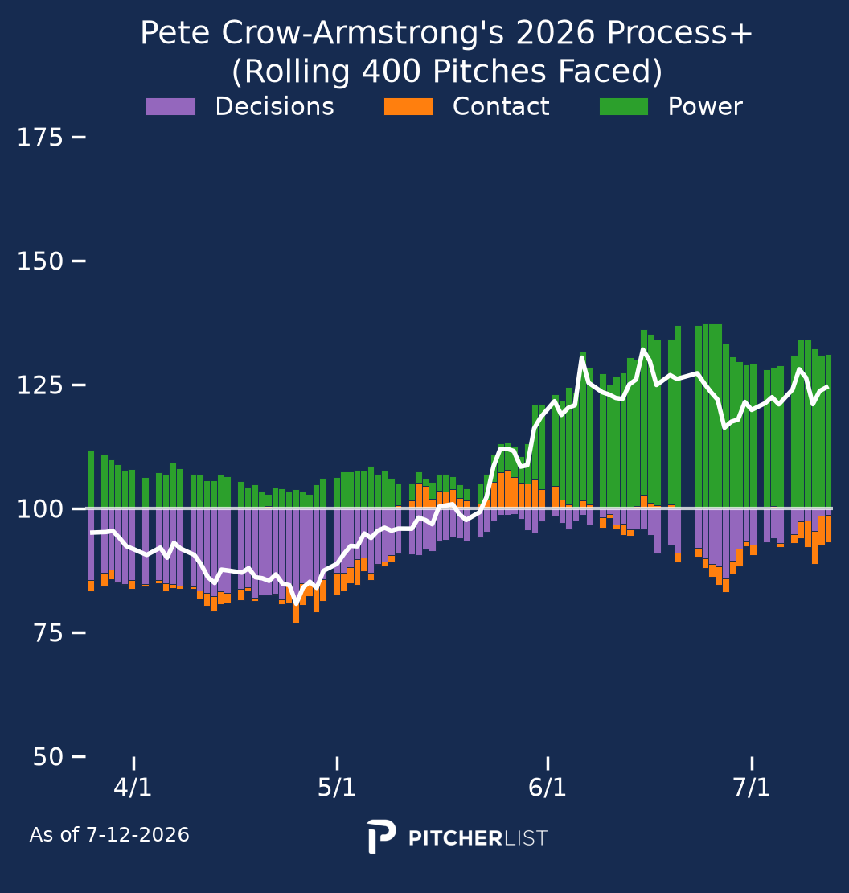
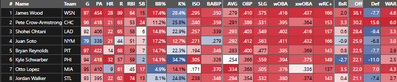
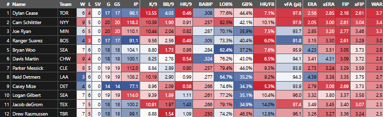
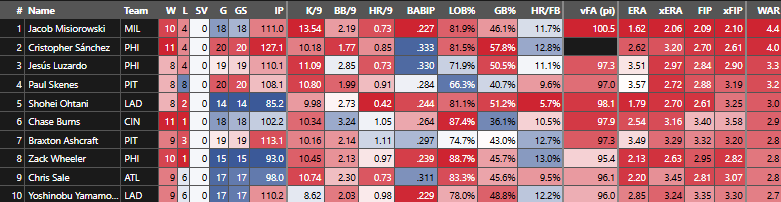
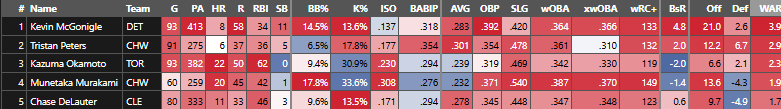
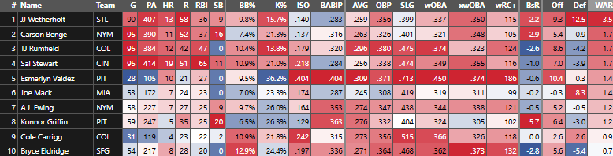

> [!abstract] Summary
> A market-by-market look at the six major awards races at the 2026 All-Star Break, using expected outcome and underlying process metrics to separate the performances that should hold from the ones that shouldn't. **Yordan Alvarez** and **Shohei Ohtani** are clear MVP favorites, but the more interesting stories sit just underneath them: **Bobby Witt Jr.** and **Pete Crow-Armstrong** are each on pace to out-WAR their league's favorite on the strength of elite defense, and **Cam Schlittler** has taken over a decimated AL Cy Young field throwing almost nothing but fastballs. **Jacob Misiorowski** is breaking velocity records and **Kevin McGonigle** has built his award case off an elite plate approach, while NL Rookie of the Year is still relatively open.

  <section>
    
MVP

    <a href="#al-mvp">American</a>
    <a href="#nl-mvp">National</a>
  </section>
  <section>
    
CY

    <a href="#al-cy">American</a>
    <a href="#nl-cy">National</a>
  </section>
  <section>
    
ROY

    <a href="#al-roy">American</a>
    <a href="#nl-roy">National</a>
  </section>

<a href="#tldr">TLDR</a>

Let's talk awards! I've been staring at these numbers every day for the last ~3 months and could use a quick look over every market with fresh eyes. For easy reference, I've included the relevant fWAR leaderboard at the bottom of each section with heatmap for (hopefully) easier viewing.

## AL MVP

This year's unequivocal best hitter in baseball, **Yordan Alvarez** is back to his usual elite form after a fractured right hand cost him the majority of his 2025 season. He is your current favorite to take home the award, and for good reason. If you like a sick triple slash, his .318/.426/.633 is about as good as you'll find in the modern game from anyone not named Aaron Judge. If you want your BaseballSavant pages lit up with [more red than a Christmas tree](https://baseballsavant.mlb.com/savant-player/yordan-alvarez-670541?stats=statcast-r-hitting-mlb), he's your guy. Take your pick of batter value metric and you'll find Yordan at the top. He's striking out only 2% more than he's walking while putting up his best slugging numbers since his 2019 Rookie of the Year campaign, driven by a career-low SwStr% and a career-high Pull Air%. IF he stays healthy, which unfortunately is not a small conditional given he's only eclipsed 140 regular season games twice in his career, he should walk this in pretty easily.

Despite the considerable gap to 2nd in offensive value, Yordan Alvarez will likely not finish as the AL WAR leader. **Bobby Witt Jr.** is currently about half a win ahead of him and [projects to](https://www.fangraphs.com/projections?pos=all&stats=bat&type=steameru) hold that lead through the final 40% of the season. This year looks like another stock BWJ season: >90th percentile defense, solidly above average at the plate, and threatening the league lead in stolen bases. He's one of the few players above Yordan on the xWOBA underperformer list, which likely comes as a result of his Pull Air% falling to a career low of 13.6% (2026 MLB average is ~18%). It's hard to take home this kind of hardware with more defensive value than offensive, as FanGraphs currently rates his performance, but he's been [more aggressive on the basepaths](https://baseballsavant.mlb.com/savant-player/bobby-witt-jr-677951?stats=statcast-r-running-mlb) this year and the underlying numbers suggest more power in his profile. Thankfully, his mid-June injury scare surrounding a Grade 1 MCL sprain doesn't seem to have lingered as he came into the break with his highest rolling HardHit% of the year.

One point I'd like to dig into more as the season moves along, but haven't had time to get comfortable with yet, is the new batter timing metrics on Savant. You can see below that the biggest difference between 2025 (left) and 2026 (right) for Bobby Witt Jr. is that he's generally much later on fastballs (red) this year. Absent a significant bat speed drop (he's only down ~0.6mph), I'd expect this to be the kind of issue that can be fixed with a plate approach shift. He also looks a little earlier on breaking balls (blue) and all over the place on offspeed (green) but I don't yet know how quickly these things stabilize. Just something to keep an eye on as we learn more.

  
  

Bobby Witt Jr. swing timing, 2025 (left) vs. 2026 (right). Source: Baseball Savant.

**Ben Rice**, **Nick Kurtz**, and **Junior Caminero** all profile as worse versions of Yordan, with >90th percentile wOBAs and bad defense. None of them are likely to be super live without an injury, and even then I'd rather put my faith in Bobby Witt Jr. finding his rhythm offensively to clear the field by multiple wins.

  

## NL MVP

Stop me if you've heard this one before: **Shohei Ohtani** is (rightfully) an overwhelming favorite for NL MVP. He's down a bit offensively this year, sporting only a 157 wRC+, but he's made up for that with 85 innings of a 1.79 ERA on the mound. There really aren't any great reasons why he shouldn't win his 5th MVP award in 6 years if he's healthy.

Adding some intrigue to the race, however, is one of the most polarizing players in baseball. **Pete Crow-Armstrong** is the epitome of the Bobby Witt Jr argument. The best defender in baseball (again), he only trails James Wood in NL Offensive Value/oRAR and has almost caught up to Shohei's combined hitting/pitching fWAR (6.3 to 6.0). He's leveled up his offensive abilities even further this year by improving his walk rate from 4th to 74th percentile and xwOBA from 44th to 85th. The quality of contact jump is driven by a 2mph bump in average bat speed YoY, resulting in a 7% increase in Hard Hit rate while maintaining the extreme 90th percentile Pull Air %. However, I'm skeptical that he can really retain the gains in walk rate. It's clear he's creating his own luck to some extent, as he's doing more damage and seeing fewer strikes than ever (pitchers likely forced to pitch more carefully), while swinging nearly 10% less than last year, but it's really hard to maintain >10% walks with a 30th percentile chase rate and a 19th percentile whiff rate. The only comps I found in the last 5 years with similar hard hit, chase, and whiff were 2022 Rafael Devers and 2023 Julio Rodriguez. Great hitters, but well below PCA's current walk rate (6.6, 8.1%). Truth be told, he probably doesn't need it to be an MVP candidate for years to come. He does damage on contact as well as guys like Shohei and Byron Buxton this year and is lapping the (out)field in fielding value. I'd just caution against believing his nuclear summer is his new standard, as we've seen the bottom drop out before and the chase/whiff will create frigid cold streaks again eventually.

  
  

Pete Crow-Armstrong rolling Process+ — decisions, contact, and power — 2025 (left) vs. 2026 (right). Source: PitcherList.

While PCA would become your MVP favorite if Shohei went down, **James Wood** is having a criminally underrated season. His aforementioned offensive value is the only one even in the neighborhood of the work Yordan has done. 100th percentile damage rate paired with 98th percentile [SEAGER decision value](https://www.baseballprospectus.com/news/article/86572/the-crooked-inning-corey-seager-rangers/)? Yeah, this guy has the kind of power and plate approach that makes his below-average Pull Air% irrelevant. The underlying process numbers back it up and his only blemish is an 18th percentile whiff rate fueling a 28% strikeout rate. Keep an eye on James Wood.

**Juan Soto** is having another elite season despite missing a few weeks. **Otto Lopez** is suddenly projected to be a 5.5 win player. **Kyle Schwarber** is still the truest three true outcome slugger. There are plenty of performances deserving of recognition but there isn't much reason to look further down the board with Ohtani being such a prohibitive favorite already.

  

## AL CY

This race turned into the [Community pizza box scene](https://www.youtube.com/watch?v=JDLFbGU2vhg) real quick, as 4 of the top 5 options here sustained long term injuries by the second week of May. **Cam Schlittler** quickly filled that void with 118.2 innings of a 2.05 ERA and did so while throwing non-fastballs only 8% (!!) of the time. Only Chad Patrick, Payton Tolle, and Drew Rasmussen are within 14% of that number. He's executing the Rasmussen gameplan (4 seamer, sinker, cutter primary + &lt;10% breaking balls) with more gas than Ras ever had. This approach of playing fastballs off each other is usually used to hide mediocre 4 seamers but Schlittler is showing just how dangerous it can be when all 3 fastballs are above average pitches. The stuff models like his curveball too, which he says he isn't throwing often simply because he hasn't needed it yet, but the ~300 he's thrown over the last year and a half have come with below-average results. The walk rate was a bit of an issue last year so he made that his primary focus in the offseason, going from 18th percentile to 93rd this year. If there's any major concern, it's that he's not great at limiting barrels in a hitter-friendly home park. He threw 164 total innings last year and should be clear for a full workload rest of season.

While Schlittler claimed first half pole position in the market, **Dylan Cease** currently has the fWAR advantage thanks in no small part to his career-best 36.9% strikeout rate. Cease is who he is at this point, pairing a 21st percentile walk rate with that elite strikeout rate, but having the best defense behind him of his career has smoothed out the rougher edges of his volatile profile. This season, he's relied less on the fastball/slider combo (83% usage -> 65%) and has leaned on a new changeup to limit home runs. This is still a profile that could blow up any given day with poor walk + homer timing, but the swing and miss is as dominant as you'll find in the American League.

**Joe Ryan** is finally putting it all together! Or maybe he's just been lucky on home runs this year. Either way, he's showcasing the best breaking ball of his career with a new knuckle curve and the flat 4 seamer remains one of the best in the game. A [scoring change](https://x.com/TalkinTwins/status/2074563151123861641) earlier this month brought him back onto the AL fWAR podium but the underlying numbers suggest his elite performance is legit. I hope that the improved arsenal is enough to keep this career-low HR/FB% down, but it's a scary time to be a fly ball pitcher (21st percentile ground ball rate) with the baseball's [drag coefficient at its lowest](https://baseballsavant.mlb.com/drag-dashboard) since the 2019 rabbit ball. Adding to the uncertainty is the potential for a Twins deadline sale, so he may not even be eligible for this award in 3 weeks.

**Jacob DeGrom** is on track to repeat his 30 start campaign from last season but is giving up way more hard contact (specifically in the air), enough to offset his silver medal 3.01 [SIERA](https://library.fangraphs.com/pitching/siera/). Without an approach change to limit barrels, I don't think the top-notch strikeout/walk numbers will be enough to bring him back from a 3.49 ERA into contention.

**Bryan Woo** (home) is the best pitcher in the AL. Bryan Woo (away) is the worst. The arsenal is elite from a pitch modeling perspective but there's something about pitching on the road that tanks his effectiveness, more than the usual T-Mobile Park effect. Maybe next year.

**Logan Gilbert** has had the opposite problem this year. He's rocking a 2.23 ERA on the road and a 4.11 at home, despite a slightly worse K-BB% away and an evenly split xFIP. Looking back through his game log, that home ERA is grossly inflated by a pair of 3 and 4 home run blowups against the Padres and Braves. I highlighted Gilbert as a potential CY contender the morning of that first blowup, with the caveat that his new arsenal (added cutter, throwing both split + changeup) may take some time to figure out. Over the last two months he has been a top ~5 starter in the AL and I think those home/road ERA splits should meet closer to 3.0. These Seattle pitchers and their splits are as unreliable as ever.

The aforementioned **Drew Rasmussen** had played himself into the top 3 of most leaderboards prior to allowing 11 ER over his last two starts. It seemed that more regular changeup usage had unlocked a new strikeout upside to complement his low walk rate and lack of hard contact, looking like a legitimate CY contender for the first time in his 3-TJ addled career. There didn't seem to be anything glaringly off in those two blow-ups but we'll see how he performs coming out of the break.

Finally; **Parker Messick**, **Nick Martinez**, **Sonny Gray**, and **Emerson Hancock** make up one big group of guys I don't expect to hold onto their sparkling ERAs pretty simply because it's not backed up by their underlying ERA estimators. Messick is the closest to his true talent imo but his command has wavered from elite to a bit above average over the course of the season.

  

## NL CY

**Jacob Misiorowski** is doing his best to make sure the world knows that [Pokémon nerds](https://www.espn.com/mlb/story/_/id/49354162/jacob-misiorowski-milwaukee-brewers-pokemon-all-star-game-2026-glove) are athletes too. He is likely the filthiest starting pitcher the game of baseball has ever seen and the results bear that out, as he's carried a 1.62 ERA and a 39.6% strikeout rate into the break this season. The biggest change year over year has been a full 5% reduction in the walk rate, despite being in the zone 3% less this season. A 2.06 xERA is silly work and there aren't any glaring red flags of regression to warrant caution. He has done nothing but improve over the course of the season. He shouldn't have much of an innings restriction, having thrown 142 AAA/MLB innings last year, but it's always something to monitor as his average velocity [continues to increase](https://www.brooksbaseball.net/velo.php?player=694819&b_hand=-1&gFilt=&pFilt=FA&time=game&minmax=ci&var=mph&s_type=2&startDate=03/30/2007&endDate=07/16/2026) throughout the year. If he pitches true to his 175 IP projection this shouldn't be much of a contest.

If Misiorowski runs into any health or innings issues, **Cristopher Sanchez** is the most likely next man up. Only Sandy Alcantara is near his inning total of 127.1 and he's even improved on last year's strikeout/walk gains, currently sporting a 22.7% K-BB to fuel his 2.62 ERA. He has run into a bit of a traffic issue heading into the break- 4 starts, 39 base runners in 22 innings. However the strikeouts are still largely there and there isn't much to suggest this is anything but the ebbs and flows of the best ground ball starter in the league. He's as good of a volume bet as ever and should have better batted ball luck going forward.

Beyond the top two, there are more obvious holes in each candidacy. **Jesús Luzardo** and **Paul Skenes** trail Cris on the fWAR leaderboard thanks to their top-end underlying numbers (K-BB, SIERA, etc.) but would need all-time second halves to offset their ~3.5 ERAs. Ohtani has been dominant on a rate basis but likely won't have the innings to qualify. **Yoshinobu Yamamoto** has excelled at generating weak contact but the perpetual 6-man rotation limits his innings upside and the strikeouts aren't as gaudy as the names above him. **Chase Burns** is pushing the limits of an elite fastball/slider combo in a tough park. Even the old vets **Chris Sale** and **Zack Wheeler** have delivered stellar results thus far, but both project to cap out around 170 innings and are running career best LOB% marks without career best strikeout rates to support them.

  

## AL ROY

It's **Kevin McGonigle**'s world and we're just living in it. He's been a top 10 position player by WAR pretty much all year, playing a pretty even everyday split between SS/3B as a 21 year old. McGonigle was one of the best pure hitters for his age that the AA level has seen in the last decade. His 162 wRC+ last year is sandwiched between 2017 Austin Riley and 2017 Ronald Acuña Jr. for minor leaguers 20 or younger, 2015 to present. While the in-game power hasn't quite translated, only average-to-slightly below in EV and power metrics, the offensive floor is as high as you'll find thanks to a legitimately elite combination of hit tool and plate approach. I cannot be entirely impartial about this guy as a Tigers fan but there aren't many nits to pick in his game. Using Robert Orr's [hitter comps](https://py-players.streamlit.app/hitter_comps) (aforementioned creator of SEAGER, the dashboard is worth the subscription), his closest comps are 2022 Mookie Betts (144 wRC+), 2021 Mookie (131), 2019 Anthony Rendon (155), and 2024 Alex Bregman (117). Pretty elite company for a 21-year-old.

**Munetaka Murakami** looked to be THE competitor to McGonigle before a hamstring injury took away his last 6 weeks. He hit 20 home runs in just under 60 games, striking out 33% of the time while taking a walk around 18%. He is as prototypical of a 3 true outcomes hitter as you'll find. My concern early in the season was that the explosive nature of his production would capture voters' attention more than McGonigle's quieter steady accumulation and offset any potential WAR gap, but being 2 full wins behind is likely insurmountable this time of year. He has the firepower to do so- it's just a matter of outrunning a 2nd percentile strikeout rate and poor defense.

The competition behind that is pretty thin. I don't believe in **Tristan Peters** continuing to overperform his expected numbers, **Kazuma Okamoto** is likely precluded from contention by his age, and nobody else is within 2 wins of McGonigle. It is worth mentioning **Parker Messick** and **Payton Tolle** briefly as they've shown to be solidly above average starters. Messick will be a down-ballot CY contender if he can hold current form (a big if, as always) and Tolle has shown flashes of a future ace. Injury aside, this is probably just McGonigle's to lose.

  

## NL ROY

We have a slightly more interesting race here in the National League, as **JJ Wetherholt** has largely kept pace with McGonigle's WAR production throughout the year. However, Wetherholt's profile is built more on defensive value than McGonigle's is, which is a knock against even if both major WAR systems agree he's an elite defender. His comps are much less kind (2022 Lane Thomas, 2024 JP Crawford, 2023 Mark Canha) and the offensive profile is more 60th-80th percentile marks than anything league-leading. He's a great all-around player whose only truly elite tool is his defense. That projects to be good for a 5 WAR player by end of season but the defensive carrying tool leaves the door open a little more than the immediate WAR read would suggest.

The toughest part of a potential Wetherholt fade is picking the horse to beat him. The NL has no shortage of interesting names, but nobody who's really started to push for contention. **Nolan McLean** was a preseason favorite but had a brutal May before recovering pretty well over the last 6 weeks (see: rookie pitchers). **Konnor Griffin** looked like he was putting it together before getting injured, coming back, and getting injured again (out until September). **Bryce Eldridge** looked like the best hitter in baseball for one month before coming back down to Earth. If anyone, Eldridge has the power to go on a 2025 Kurtz-like run in the second half, but a worse park, team context, and hit tool. That's a lot to outrun. Similarly **Sal Stewart** has been hot and cold all year but has a great home park if he can find a more consistent approach. **Carson Benge** and **A.J. Ewing** both look like solid big-leaguers in the long run, just not quite explosive enough to close the gap in a timely manner.

The whole field is uninspiring but JJ has not closed the door yet. Something to monitor.

  

## TLDR

| | |
|---|---|
| **AL MVP** | Elite hitting seasons win MVP- big gap between Yordan and field. BWJ will probably finish well ahead in total WAR, which could make for an interesting finish if the offense comes back. |
| **NL MVP** | Shohei's to lose. PCA super high ceiling but low floor is still present, Wood is the NL version of Yordan. |
| **AL CY** | Schlittler looks like the guy to beat, think Cease is too volatile to avoid blowups for the last 70 games. Any long-term effect of [adding as much velo](https://pitcherlist.com/cam-schlittler-and-building-an-elite-arsenal/) as Schlittler has since 2023? Gilbert, Ryan, Ras have the ceiling to take it if the top two falter. |
| **NL CY** | Mis is sick but averaging 102 probably not sustainable for another 70 innings. Cris still solidly 2nd, Wheeler legacy CY would be awesome coming off TOS. Worry a bit about Sale's durability but he's been a stud. What's [wrong with Paul](https://www.brooksbaseball.net/velo.php?player=694973&b_hand=-1&gFilt=&pFilt=FA&time=game&minmax=ci&var=mph&s_type=2&startDate=03/30/2007&endDate=07/17/2026)? |
| **AL ROY** | Kevin McGonigle is the next Mookie Betts. Either Murakami needs to hit 40 homers or Messick needs a 2.0 ERA rest of year to make it a race. |
| **NL ROY** | Wetherholt going to hit 5 WAR just from playing good defense and being okay on offense. Door is open for someone to catch him, but nobody has looked consistently explosive enough to do so. |

 

<em>Questions, comments, etc. welcome- just message me.</em>

