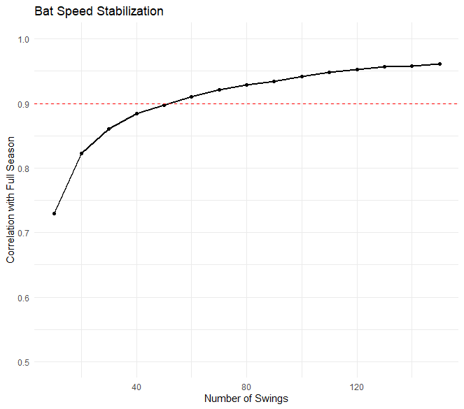
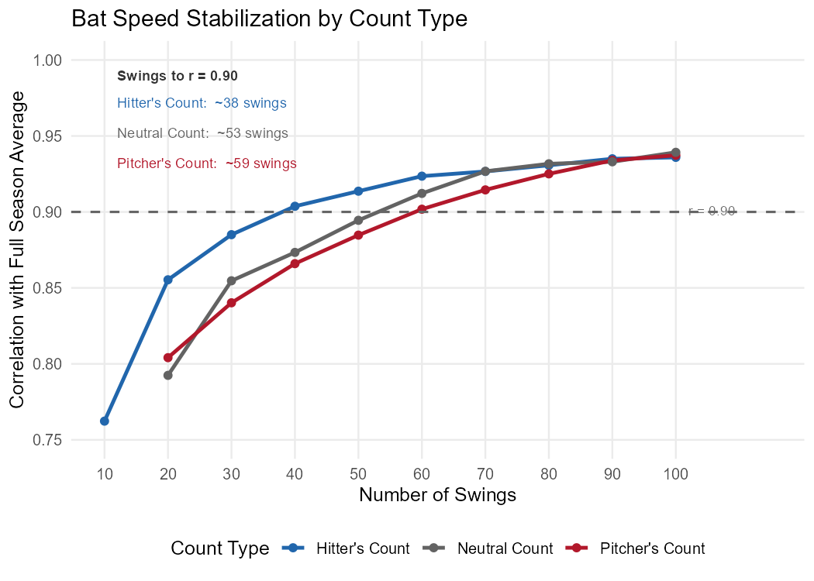

### Overview

This project builds on the foundation laid in [Bat Speed Analysis 1.0](/projects/bat-speed/), delivering on two open questions from that work: how quickly does bat speed become a reliable signal, and does the complexity of derived metrics like "impulse" actually add predictive value over raw speed?

Data was pulled via a chunked Savant scrape using `baseballr` at weekly intervals across the full 2025 regular season. Initially, there were consistent issues getting the first 1-2 months of data but this was fairly easily resolved by increasing fixed request delays in retry catches. Our final dataset contained ~300k swings from 600+ batters. While BaseballSavant has its own "Competitive Swing" designation, I chose to filter based on an IQR threshold (below Q1 − 1.5×IQR per player) before any aggregation.

---

### Finding 1: Bat Speed Stabilizes Fast

My longest-standing question regarding bat speed has always been how quickly it becomes meaningful. Intuitively, it shouldn't take long- other analyses have even suggested stabilization in as few as 10 swings, but those typically measure when a single player's rolling average stops fluctuating, rather than when we can predict long-term averages based on early samples. My research showed that bat speed reaches r = 0.90 correlation with full-season average in approximately **50 swings**; not quite as quick as I expected, but faster than almost any traditional batting metric. 

The more useful takeaway is what happens when you filter by count type. While talking through my initial findings, one of the Ball Knowers in my life suggested that hitter's count swings might stabilize faster, and that proved to be entirely true- reaching r = 0.90 roughly 35% faster than pitcher's count swings. For small-sample evaluation (spring training, early-season), hitter's count bat speed is the most reliable signal available.

*Early-count bat speed predicting full-season average. Hitter's counts (blue) stabilize fastest.*

---

### Finding 2: Average Bat Speed Is Still King

The central question motivating this project was whether derived metrics add signal beyond raw speed. The short answer is no.

**Seasonal correlations with outcomes:**

| Metric | Barrel% | EV50 | xwOBA | Whiff% |
|--------|---------|------|-------|--------|
| Avg Bat Speed | 0.72 | 0.87 | 0.45 | 0.66 |
| Swing Length | 0.41 | 0.43 | 0.18 | 0.43 |
| Impulse (v²/L) | 0.51 | 0.66 | 0.38 | 0.42 |

The value of length-adjusted bat speed has been casually speculated on over the last couple years, most commonly referred to as "bat acceleration." I settled on "impulse" (speed²/length) as a label, calculated at the individual swing level rather than from seasonal averages. The intuition makes sense: a short, fast swing should be a more reliable tool than an equally fast but longer one. To test this thoroughly, I evaluated impulse at every 5th percentile cut (5th, 10th, 15th, through 95th) against barrel%, EV50, xwOBA, xBA, xSLG, hard hit rate, and other standard hitting metrics. The same percentile sweep was run for raw bat speed as well, 5th through 95th, to see whether ceiling metrics like the 90th or 95th percentile carried more signal than average. They did not. Average bat speed outperformed every percentile cut and every impulse variant tested. Swing length on its own is even weaker, though that isn't necessarily a surprise.

Whiff rate is the one outcome where I most expected impulse to differentiate, thinking if swing efficiency matters anywhere, it should be in the simple ability to get bat to ball. Unfortunately- it doesn't (r = 0.42 vs. 0.66 for raw speed). This correlation does validate a common assumption, that a faster swing spends less time "on plane" / in the zone, leaving less margin for timing error and leading to more frequent swing and miss. This is the backbone of the three true outcome slugger, with a high bat speed being the main driver of both whiffs and damage done on contact. At the end of the day, bat speed captures both better than any derivative metric.

---

### Count and Pitch Type Effects

While swings in hitter's counts stabilize fastest, being in a disadvantaged count actually has more of an impact on bat speed. The correlations are somewhat weak, but directionally notable: pitcher count frequency (r = −0.197), hitter count frequency (r = +0.089), fastball frequency (r = −0.126). This means that pitcher's counts suppress bat speed more than hitter's counts elevate it, indicating that being behind forces defensive swings more significantly than being ahead allows the hitter a full green light. My count designations were based on Tom Tango's 2018 [run expectancy chart.](https://tangotiger.com/index.php/site/re288-run-expectancy-by-the-24-base-out-states-x-12-plate-count-states-recu)

**Pitch type** effects are even weaker. Batters swing hardest at changeups (70.5 mph vs. 69.6 mph on fastballs) and a player's bat speed on one pitch type is almost entirely unrelated to their bat speed on another (r = −0.05 to 0.09 across type pairs). This kind of pitch type-specific bat speed adds no value as an evaluation shortcut, but **expected** pitch type is likely the underlying driver of these differences and the more valuable angle long-term. Stephen Sutton-Brown has done some [awesome work](https://www.baseballprospectus.com/news/article/103703/best-of-bp-2025-understanding-swing-processes-through-bat-and-pitch-tracking/) in this vein at BaseballProspectus- I'd highly recommend checking out his whole portfolio.

---

### Consistency

Faster swingers exhibit more consistent swing speeds (r = −0.45 between average speed and within-season SD). My initial inclination was that this may be skewed by lower volume / lower bat speed role players, but this relationship persists among high-volume regulars (600+ swings, r = −0.42), suggesting it reflects genuine mechanical stability.

---

### Limitations

Contact point depth is the most meaningful piece missing from this analysis. Hitters who "let it travel" have less time to generate bat speed, so raw speed comparisons are somewhat contact point-dependent. While Statcast data does include an intercept point metric, it proved to be mostly useless in my analysis as this measure is relative to the plate- not relative to batter center of mass. Swing length partially proxies for this but is too confounded by bat path to be useful as a standalone adjustment. I'd love to see what contact point-adjusted bat speed will yield once we have COM-based contact point on a per-pitch level and I'm disappointed to have missed Kevin Giordano's presentation on this at the 2026 SABR Analytics Conference. 

---

### Technical Notes

- **Software:** R 4.x, tidyverse, baseballr
- **Sample:** 2025 regular season, March 18 – September 28
- **Filters:** game_type == "R", bat_speed not NA, non-competitive swings removed (IQR method), minimum 30 swings for player inclusion
- **Rolling windows:** k = 50 swings, right-aligned. Windows of 30, 50, 75, and 100 swings were evaluated; 50 provided the best balance of stability and responsiveness.
