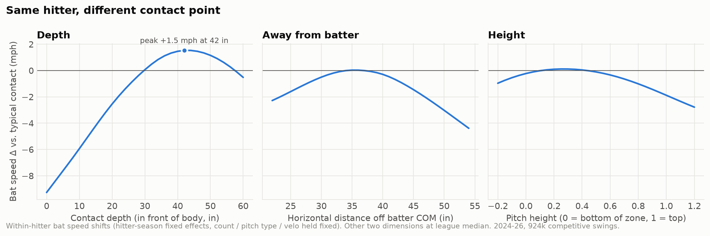
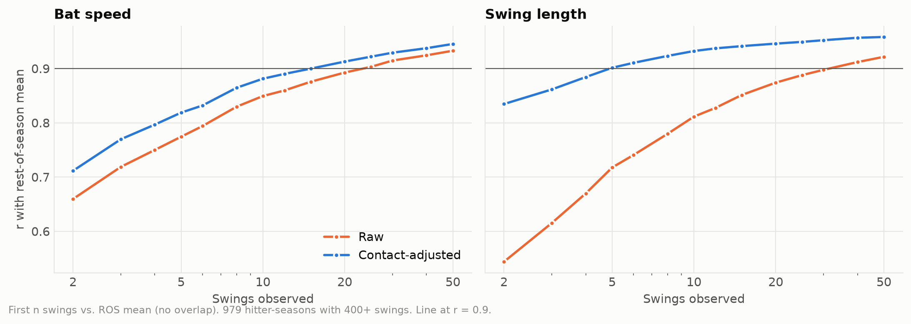
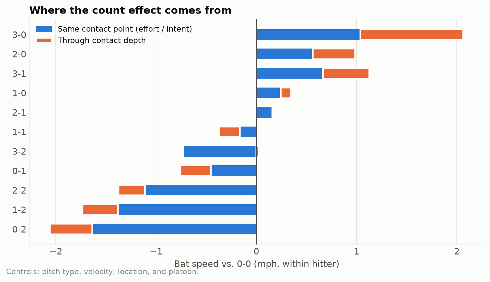
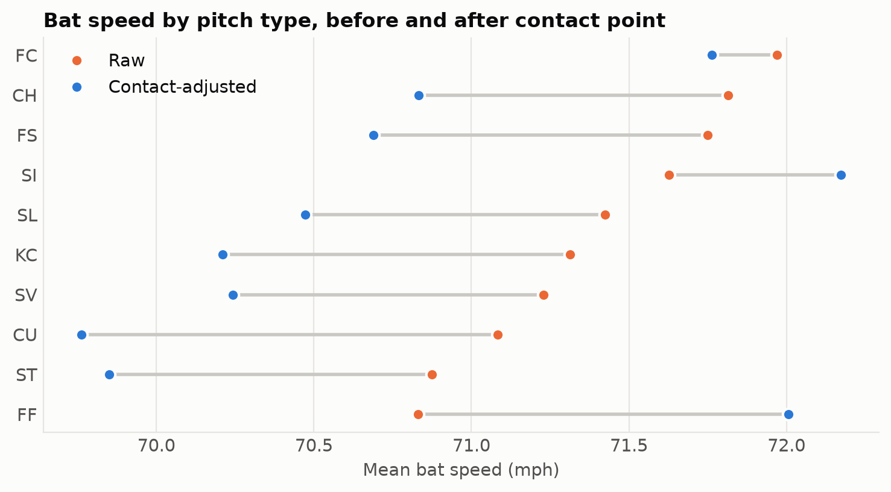
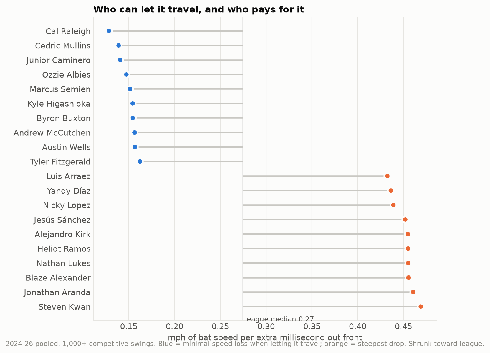
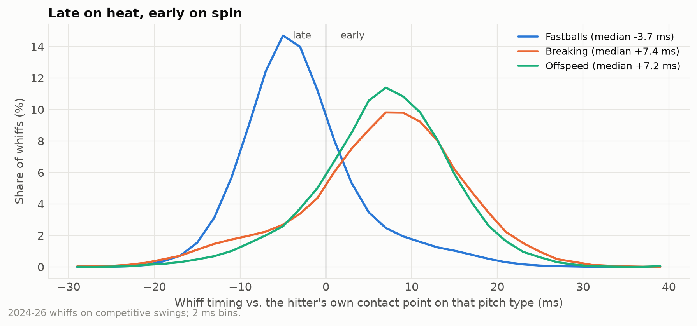
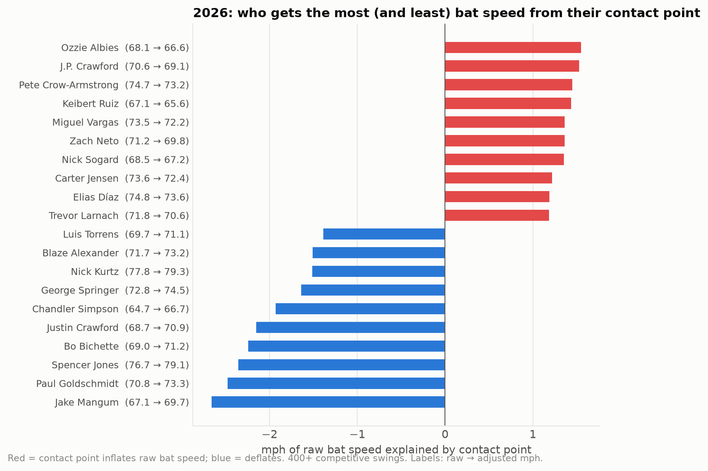

> [!abstract] Summary
> Savant gives us contact point relative to the hitter on every tracked swing, 
> so this project finally adjusts bat speed for where the ball was met. Contact point matters a lot 
> for any single swing (~0.2 mph for every inch further out front, and it explains most of what swing length measures). 
> Raw bat speed is really two things bundled together: how hard a hitter swings, and where he tends to meet the ball. 
> The contact-adjusted version isolates the first. Raw bat speed is still the better predictor of next year's production, because 
> contact point is sticky and comes packaged with pull-side damage. Adjusted bat speed is the cleaner measure of the swing itself: 
> it stabilizes faster, it explains why hitters "swing harder" at changeups, and when paired with where a hitter actually 
> meets the ball the following year, it out-predicts raw speed. 
> As always- do we want to know more about the player himself, or how their talent translates on-field?

### Overview

The biggest hole in [Bat Speed Analysis 2.0](https://ryanliam-bio.github.io/baseball_analytics/projects/bat-speed-extension/) was contact point. 
Hitters who let the ball travel have less time to get the barrel up to speed, so comparing raw bat speed between two hitters is partly comparing 
where they meet the ball. In 2.0 I wrote that Statcast's intercept point was relative to the plate and not the hitter, but
the baseballr commit history indicates we've had COM-relative contact point for a while now. Regardless of whether
this is a new addition or I just whiffed on that, we have more than enough data to draw some conclusions on these second-order metrics.

So I pulled every regular season swing from 2024 through this past weekend (~1M swings), one day at a time. 
The IQR filter for non-competitive swings from 2.0 is applied up front, to everything, which leaves **924k competitive swings** from 
roughly 2,000 hitter-seasons. Building this is also how I found that 2.0's filter never actually applied to the swings used to determine stabilization numbers. 
That page now has a correction note, and the short version is that bat speed stabilizes even faster than I said.

The question this time is the same one 2.0 asked about "impulse": once you account for where a hitter met the ball, what's left in bat speed, 
and what is it good for?

---

### Contact Point, One Swing at a Time

Savant splits contact point into two pieces, both measured from the hitter's center of mass (the midpoint between his hips): 
**depth**, how far out front (toward the pitcher) the contact happens, and a **horizontal** distance across the plate. 
Horizontal mixes pitch location with where the hitter stands in the box, but since the model only compares each hitter's swings to 
his own other swings that season, his usual stance mostly drops out and what's left is inside vs. away. The third panel is pitch height 
relative to his strike zone, not contact height (Savant doesn't give a vertical contact point). Count, pitch type, and velocity are held constant.

Around the typical contact point (~30 inches in front of the hitter's center of mass), every extra inch out front is worth about **0.22 mph** 
of bat speed. That number barely moves season to season (0.21-0.23). The gain tops out around 42 inches out front at +1.5 mph over a typical swing,
then fades as hitters start lunging. Let it travel all the way to even with center of mass and you're giving up ~9 mph. 
Inside vs outside there's a sweet spot around 35 inches- getting jammed (−2.3 mph at 22 in) or reaching (−3.7 mph at 52 in) both cost you. 
Height matters least: hitters swing hardest around the lower third of the zone and ~2 mph slower at the top.

Contact point alone explains about **27%** of how a hitter's bat speed varies swing to swing. For swing length it's **86%**. 
Swing length on any given swing is mostly a reading of where the ball was met, which goes a long way toward explaining why it was such a weak 
standalone metric in 2.0.

*Described above, catch the ball in front!*

---

### Finding 1: Raw Bat Speed Still Predicts Production Best

Contact-adjusted bat speed is each swing's bat speed as if it had been met at a league-average contact point, averaged over the season. 
Raw bat speed is that plus the bat speed a hitter gets (or gives up) from where he tends to meet the ball. 
Same idea for swing length and impulse (still calling speed²/length "impulse" for continuity with 2.0).

2.0 checked these metrics against same-season outcomes. This time we took the natural next step: 
how well this season's number predicts *next* season, for the 735 hitters with 150+ competitive swings in back-to-back years.

**Correlation with next-season outcomes:**

| Metric | Barrel% | EV50 | Hard-Hit% | xwOBAcon | Whiff% |
| ------------------------------- | ------- | ---- | --------- | -------- | ------ |
| Avg Bat Speed | 0.67 | 0.79 | 0.68 | 0.62 | 0.57 |
| Contact-Adjusted Bat Speed | 0.64 | 0.77 | 0.66 | 0.62 | 0.55 |
| Swing Length | 0.40 | 0.42 | 0.35 | 0.30 | 0.38 |
| Contact-Adjusted Swing Length | 0.30 | 0.32 | 0.27 | 0.24 | 0.26 |
| Impulse (v²/L) | 0.48 | 0.61 | 0.53 | 0.51 | 0.37 |
| Contact-Adjusted Impulse | 0.51 | 0.65 | 0.55 | 0.53 | 0.43 |

*Whiff% correlations are positive because faster swings whiff more. Outcomes are built from swings only (xwOBAcon rather than xwOBA), so these aren't directly comparable to the 2.0 table.*

Raw bat speed wins every column, and that's no surprise- it has much more information baked in than the adjusted version.
The hitters who get the most bat speed from their contact point are the ones who meet the ball out front. Call that difference between raw and 
adjusted speed contact point credit: the mph a hitter's usual contact point adds to (or takes off) his raw bat speed. 
Those hitters are mostly pull hitters (r = 0.34 between contact point credit and pull rate), and pulling the ball comes with damage. Impulse is the only metric the adjustment helps, and it still trails raw bat speed 
everywhere. Adjusted swing length gets worse across the board by about 0.1, since most of what raw swing length measures is contact point.

The reason raw speed wins *next* season is that contact point is sticky: a hitter's average contact depth correlates at r = 0.85 year to year. 
Raw bat speed quietly assumes that next year's contact point will look like this year's, and it does not often make a fool out of u and me. 
Trying to avoid the disappointment of creating another derivative metric that underperforms the original, 
I gave the adjusted version the one piece it's missing- each hitter's actual contact point credit (again, how much speed is added/taken from contact point) the following season:

| Predicting next season (out-of-sample R²) | Barrel% | EV50 | Hard-Hit% | xwOBAcon | Whiff% |
| --- | --- | --- | --- | --- | --- |
| Raw bat speed | 0.442 | 0.619 | 0.455 | 0.381 | 0.318 |
| Adjusted bat speed | 0.408 | 0.595 | 0.436 | 0.373 | 0.302 |
| Adjusted + next year's contact point credit | **0.458** | **0.634** | **0.468** | **0.391** | 0.318 |

Once you know both how hard a player swings and where they'll meet the ball, the pair beats raw speed on every batted ball outcome. 
The edge is small because "same contact point as last year" is a good guess for most hitters. 
Where it matters is a hitter whose contact point has clearly changed. Raw speed from last season assumes the old contact point, adjusted speed 
plus the new one doesn't. Cam Smith (more on him below) is a good example.

---

### Finding 2: Adjusted Metrics Are Cleaner

Where the adjustment pays off is reliability. Using 2.0's method (correlation between a hitter's first n swings and his full-season average), 
raw bat speed hits r = 0.90 in about **20 swings** and contact-adjusted bat speed in about **14**. Year over year, adjusted bat speed is a 
little stickier too (r = 0.934 vs 0.921).

Adjusted swing length stabilizes almost immediately, but that's simply because contact point explains 86% of how swing 
length moves from swing to swing. Taking it out leaves very little noise. On its own it isn't worth much and isn't much more than a bat speed proxy. 
It only becomes useful next to bat speed, as a measure of how direct the swing is (see the acceleration section).

So the adjusted numbers are the cleaner measure of the swing itself, and raw bat speed is the better predictor of production as long as a 
hitter's approach holds steady. 

*A stricter version of 2.0's test: a hitter's first n swings vs his rest-of-season average, so the swings being tested aren't 
also part of the answer. Everything crosses r = 0.90 a few swings later than the numbers above (raw ~24, adjusted ~15), 
or about 3-4 games raw and 2 adjusted, but the gap between them holds.*

---

### What About Bat Acceleration?

Bat acceleration has been derived from Statcast's bat speed and swing length a few different ways since the data came out, and 2.0's version was 
"impulse." With the (flawed) assumption of constant acceleration, average acceleration is v²/2L, so impulse (v²/L) is just twice that. 
In this data it isn't more reliable than speed (impulse takes ~36 swings to stabilize vs ~20 for raw bat speed), and it's less sticky year to year (0.905 vs 0.921). 
The contact adjustment helps it more than any other metric but only enough to catch up to raw speed.

The more useful piece is swing length relative to bat speed: how much path a hitter needs to reach a given speed. (If tracking starts at swing onset and the bat sped up evenly, it'd convert to a swing time of roughly 140 ms, but neither assumption is solid enough to lean on.) As a trait, it's more interesting than impulse ever looked:

- It's stable (r = 0.92 year over year, contact-adjusted).
- It's nearly independent of bat speed (r = −0.16), where impulse overlaps heavily with speed (r = 0.70). That overlap is why impulse always looked like bat speed's weaker twin.
- It tells you nothing about whiffs at a given bat speed (r = −0.02).
- It does tell you where a hitter meets the ball. At the same bat speed, shorter paths make contact further out front (r = −0.41, and −0.37 for next season), and go with slightly more damage the following year (EV50, r = −0.22).

The leaderboard suggests it's as much about swing shape as anything. This year's shortest paths for their bat speed include Kyle Stowers, 
Elias Díaz, Elly De La Cruz, and Corey Seager. The longest belong to Cody Bellinger, Marcus Semien, Jung Hoo Lee, Isaac Paredes, Rhys Hoskins, 
and Nolan Arenado- a lot of heavy pull hitters. At the same contact depth, a longer path goes with more pulling (r = +0.29), so I'd read those 
as more rotational swings around the ball rather than slow ones. A longer path should mean starting the swing earlier, though, and whether that 
shows up in swing decisions is the next thing I want to test.

---

### Counts and Pitch Types, Revisited

2.0 argued that pitcher's counts suppress bat speed more than hitter's counts raise it. That holds up and even looks better now that I compare 
each hitter to himself. Using the same Tango count buckets as 2.0, the same hitter swings **1.85 mph** slower in pitcher's counts than in neutral 
counts, and basically no faster in hitter's counts (+0.03).

About 0.5mph of that is pitch location. Hitters chase more in pitcher's counts (64% of their swings come on pitches in the zone, vs 
77% in neutral counts), and those swings are slower. Holding pitch type, velocity, location, and platoon constant, the pitcher's count 
drop is **1.35 mph**. Only about 20% of that (0.3 mph) comes from making contact deeper- about 1.8 inches. The rest is a softer swing at the same 
contact point.

Broken out by count, 0-2 costs 2.1 mph vs 0-0, with 1.6 of that at the same contact point. 3-0 adds 2.1, split about evenly between a harder 
swing and meeting the ball further out front (on only ~1,700 swings, so take that one loosely). The hitter's count bucket washes out because 
3-2 lives in it, and 3-2 is its own animal: hitters swing 0.7 mph softer than 0-0 while barely letting the ball get any deeper. 
A shortened swing that doesn't give up ground on timing.

*Within-hitter bat speed by count vs 0-0, split into the part at the same contact point and the part that comes with a deeper/shallower contact point. Controls for pitch type, velocity, location, and platoon.*

2.0 also found hitters swing hardest at changeups. That's still true in raw terms (71.8 mph vs 70.8 on four-seamers), 
and contact point accounts for the gap. Changeups get met about 13 inches further out front than four-seamers (37 vs 24 in). 
At the same contact point, hitters swing harder at four-seamers (72.0) than changeups (70.8), and breaking balls come in below both. 
Hitters aren't swinging harder at soft stuff- they're out in front of it. My guess is that's the "expected pitch type" idea from 2.0 showing up: 
hitters are geared for velocity and the offspeed catches them early.

---

### Who Can Let It Travel?

Since we have every hitter's contact point on every swing, we can also measure how much bat speed each one gives up when he lets the ball 
get deeper. Converting depth to time, the typical hitter gives up about **0.27 mph for every extra millisecond** (10th-90th percentile: 
0.19 to 0.38). The hitter-specific part of that is a stable trait (r = 0.89 year over year).

*2024-26 pooled, hitters with 1,000+ competitive swings.*

There are two ways to land at the top of this list. Raleigh, Caminero, and Albies mostly get there by meeting the ball so far out 
front that they live on the flat part of the curve. Buxton, McCutchen, and Mullins are the ones who genuinely hold their bat speed 
when they get deep. At the bottom, Kwan, Arraez, Kirk, Yandy Díaz, and Jesús Sánchez all lose more speed than their contact point explains. 
For the contact-first guys especially, I'd guess that's a choice rather than a limitation- flicking a deep pitch the other way instead of 
trying to do damage with it. Steeper depth costs go with *lower* whiff rates (r = −0.30), which fits, though the data can't separate 
choosing to shorten up from not being able to get there.

Cam Smith, who I dinged in the 2025 awards check-in for letting the ball travel too deep, met it about 3 ms further out front this 
year and is up 2.8 mph in adjusted bat speed (74.6 → 77.4). This is the kind of case where last year's raw bat speed undersells him, as 
his swing got faster *and* his contact point moved. The league curve does a good job predicting these moves: 
for hitters whose contact point shifted year over year, predicted vs actual change in contact point credit correlates at r = 0.88, though it overstates the gain by ~15-20% (Smith's move predicted +0.9 mph and delivered +0.6).

---

### Late on Heat, Early on Spin

The intercept point is recorded on whiffs too (where the bat was when it got closest to the ball), so we can see whether a swing and miss was 
early or late relative to that hitter's normal contact point on that pitch type. The split is pretty stark. Fastball whiffs come a median 
**3.7 ms late**, while breaking and offspeed whiffs come **~7 ms early**. 40% of fastball whiffs are more than 5 ms late, and 
62% of breaking/offspeed whiffs are more than 5 ms early. Nearly half of fastball whiffs (47%) are near misses: normal timing, 
bat missed by less than 3 inches. Pitch recognition is truly only half the battle.

In the 2026 awards check-in I wondered how quickly Savant's new timing data stabilizes. Using my own version (how much further out 
front a hitter meets breaking balls than fastballs, contact swings only), it's a real trait (r ≈ 0.75 year over year) that, by itself, tells 
you almost nothing about whiff rate (r = 0.07). I'd be hesitant to draw any meaningful conclusions at this point.

---

### 2026 Contact Credit

Finally, the fun one: who gained and lost the most raw bat speed from where they made contact this season.

Nick Kurtz jumps from 3rd to **1st** in adjusted bat speed (77.8 → 79.3 mph). He makes contact deeper than all but a handful of 
qualified hitters and still swings harder than everyone. Jake Mangum, Paul Goldschmidt (204th → 91st), and Spencer Jones (76.7 → 79.1) get the 
biggest boosts. On the other side, about 1.5 mph of Ozzie Albies', J.P. Crawford's, and Pete Crow-Armstrong's raw bat speed comes from meeting the 
ball way out front.

That's not a knock on any of them. Per Finding 1, out-front bat speed is real bat speed, and it comes with real damage. 
It does add some context to the PCA bat speed jump I wrote about in July, though: he's up 2.4 mph raw year over year in this data, and about 
1.9 of that survives the adjustment. The rest is him getting even further out front.

---

### Limitations

Contact point and approach are tangled together. Hitters choose where to meet the ball, so adjusting for contact point also strips out part of their approach. The adjustment answers "how hard does he swing?" rather than "how good is his swing?". Same issue with the depth cost numbers, which can't separate a hitter choosing to shorten up on deep pitches from not being able to get to them.

Bat tracking is missing more often on the hardest-hit balls (10% of 105+ mph balls in play vs 3.5% under 90), so the very top of the damage distribution is slightly underrepresented. 2024 coverage is thin early (no tracking in March, ~88% in April). Outcomes here are built from swings only- no walks or called strikeouts. Whiff "contact point" is the bat's closest approach to the ball, which is noisier than actual contact.

---

### Technical Notes

- **Software:** Python 3.11, pandas, NumPy, scikit-learn, matplotlib
- **Data:** Savant search CSV, every regular season pitch 2024-26 (through Sept 27), one day per request. 2.0's weekly pulls hit Savant's 25,000-row export cap; daily pulls stay well under it.
- **Sample:** ~1.01M non-bunt swings → 971k with complete bat tracking → 924k competitive swings across 1,982 hitter-seasons (1,415 with 150+ swings)
- **Filters:** game_type == "R", bunts removed, non-competitive swings removed with 2.0's IQR rule (below Q1 − 1.5×IQR per hitter-season) before every analysis. A flat 50 mph floor instead gives nearly identical adjusted bat speeds (r = 0.998).
- **Contact model:** hitter-season fixed effects + cubic splines on contact depth, side-to-side distance from the body, and pitch height (scaled to each hitter's zone), with pairwise interactions; count, pitch group, and velocity as controls. Adjusted value = raw value − (contact effect for that swing − league-average contact effect), so raw and adjusted share the same league average.
- **Count effects:** within-hitter, Tango count buckets; controls for pitch type, velocity, pitch location (side-adjusted horizontal position, zone-relative height, Savant zone), and platoon
- **Depth in ms:** contact depth ÷ the ball's speed at the front of the plate, from each pitch's Statcast trajectory
- **Stabilization:** first n swings in game order vs full season (2.0's method) and vs rest of season, hitter-seasons with 400+ swings
- **Next-season tests:** 735 hitters with 150+ competitive swings in consecutive seasons, confidence intervals from resampling hitters
- **Validation:** the full pipeline was first run on simulated swings with known effects. Key numbers were re-derived with separate code, including a gradient boosting model in place of the splines (29% vs 27% of within-hitter bat speed variance). A single league-wide contact curve gives nearly identical adjusted bat speeds to the within-hitter version (r = 0.999).
- **Code and results tables:** available on request

 

<em>Questions, comments, etc. welcome- just message me.</em>

