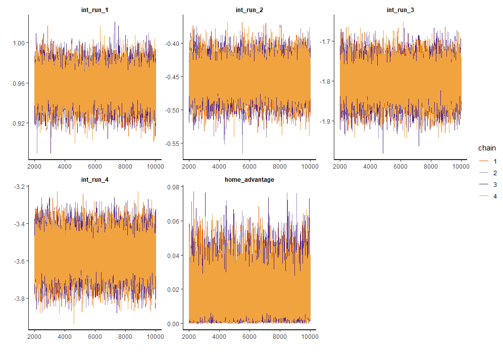
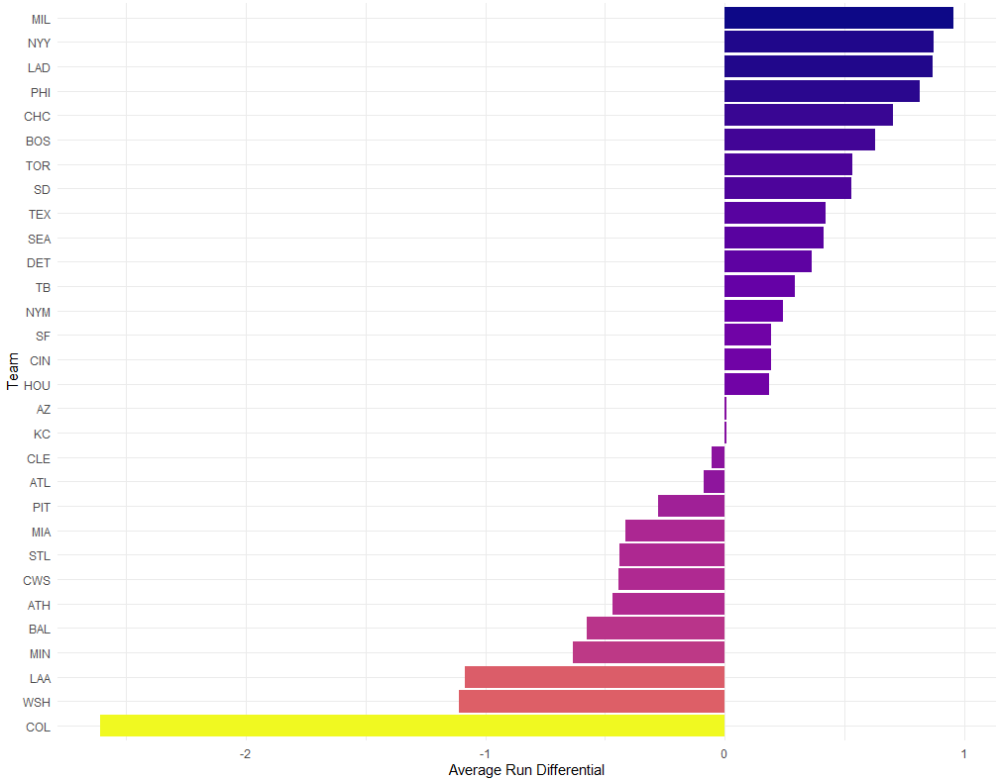
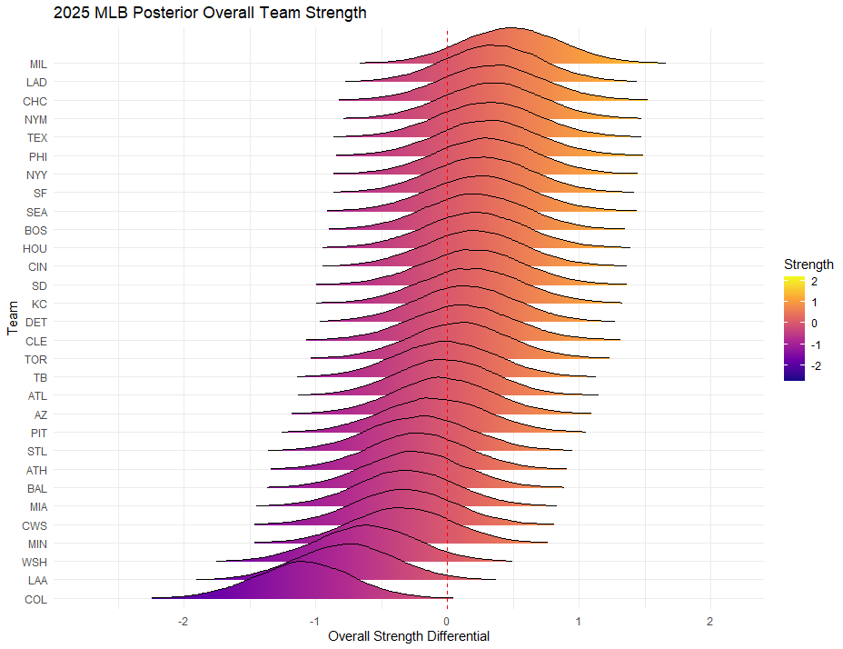
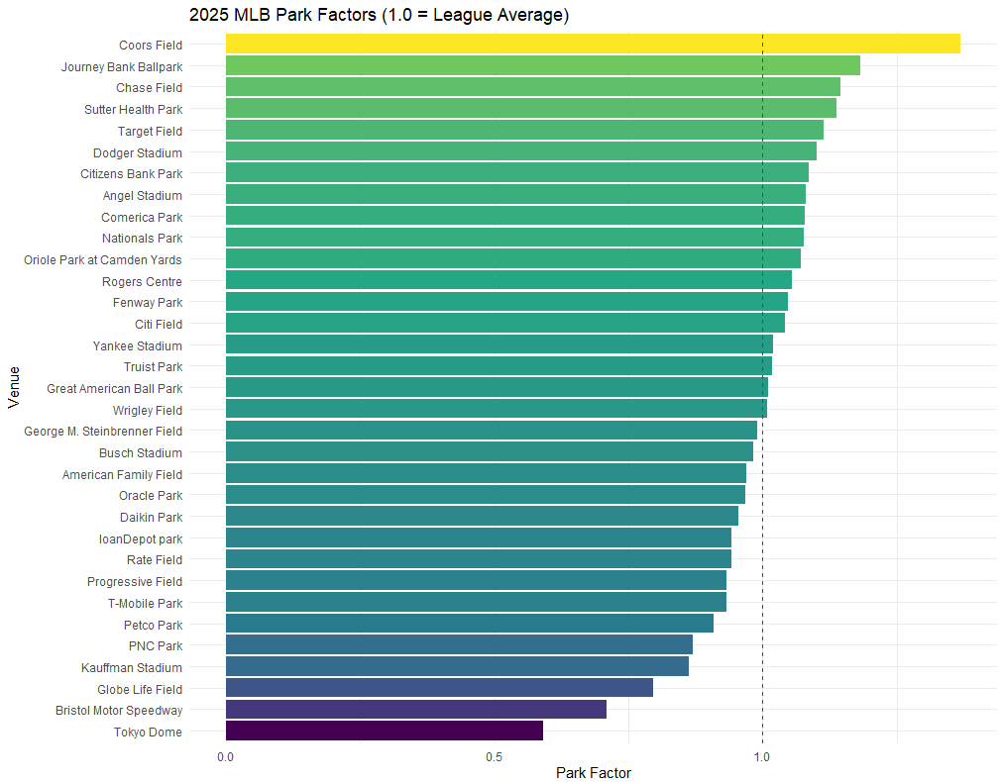
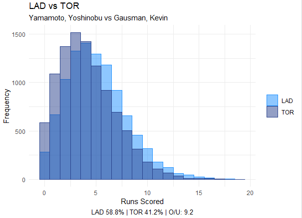
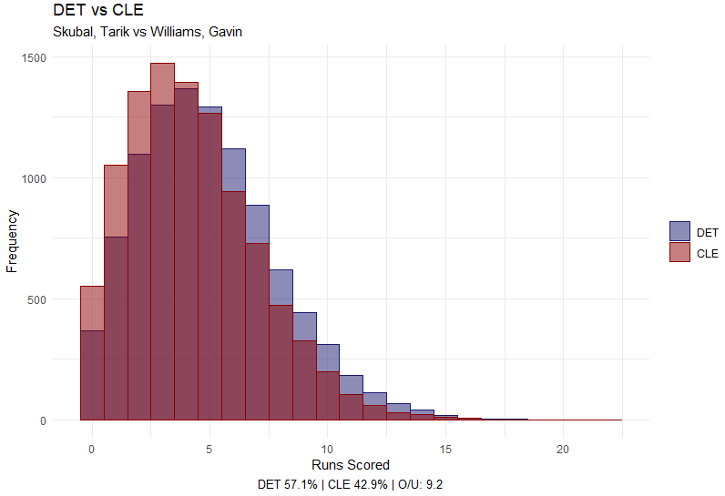
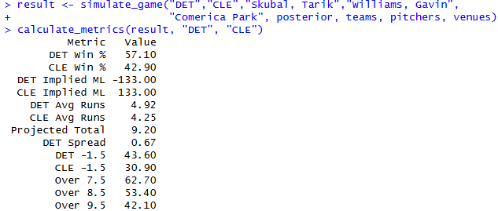

 <a href="2025_model_complete_backup.R" download="2025 Bayesian Team Strength" class="btn btn-primary">
  📥  Download Full R Script
  </a>

---
 ### Motivation

  Traditional run-scoring models often treat total runs as a single outcome, obscuring the underlying mechanics of how teams generate offense. This
  project decomposes scoring into discrete run-event types (1-run, 2-run, 3-run, 4-run increments) and models each separately, allowing for
  differentiated team profiles and more granular uncertainty quantification.

  The hierarchical Bayesian framework provides full posterior distributions for team attack/defense abilities, starting pitcher effects, and park
  factors, enabling probabilistic game simulation with propagated uncertainty.

  ---

  ### Model Structure

  The model estimates latent parameters for:
  - **Team Offense (Attack)**: Run-generating ability by event type
  - **Team Defense**: Run-prevention ability by event type
  - **Pitcher Ability**: Starting pitcher impact (centered, shared across run types)
  - **Park Effects**: Venue-level adjustments
  - **Home Advantage**: Global intercept shift for home teams

 Run events are modeled on the log scale:

  

  $$\log(\lambda) = \alpha_r + \text{att}_r^{\text{home}} + \text{def}_r^{\text{away}} + \text{pitcher}^{\text{opp}} + \text{park} + \text{home
  adv}$$

  

  where $r \in \{1, 2, 3, 4\}$ indexes run-event type.

  ---

  ### Distribution Selection

  Model comparison via LOO-PSIS indicated:
  - **Negative Binomial**: Superior fit for 1-run and 2-run events (accounts for overdispersion)
  - **Poisson**: Adequate for 3-run and 4-run events (rare, less variable)

  This hybrid approach respects the empirical variance structure of each run type rather than forcing a single distributional assumption across all
  outcomes.
  
  I will note that LOO-PSIS comparison indicated that negative binomial was also a marginally better fit
  for 3-run events, but the dispersion parameter was creating impossibly high variance
  in run scoring. For this reason, the model swapped to Poisson distribution and had no issues thereafter.

  
  *MCMC diagnostics showing convergence (Rhat ≈ 1.0, effective sample sizes > 1000) for key parameters.*

  ---

  ### Data Pipeline

  Statcast pitch-level data was aggregated to identify run-scoring events, defined as any plate appearance where `post_bat_score > bat_score`.
  Events were capped at 4 runs (grand slams) and categorized by:
  - Batting team (home/away)
  - Starting pitcher faced
  - Venue

  Games with score mismatches between aggregated events and final scores (typically due to incomplete Statcast feeds) were excluded, resulting in
  ~2,400 verified games for the 2025 regular season.

  
  *Preliminary team strength via raw run differential.*

  ---

  ### Results

  The posterior team strength distributions reveal separation between contenders and rebuilding clubs, with appropriate uncertainty bands reflecting
   sample size and schedule strength.

  
  *Posterior distributions of overall team strength (attack - defense) across all run types.*

  Park factors derived from the model align with expected tendencies (Coors Field elevated, pitcher-friendly parks suppressed), though neutral-site
  estimates carry wider uncertainty due to limited sample. It is also important to note the inherent year-to-year variance of park factors-
  a 3-year rolling sample would be more appropriate in future iterations. Weakly informative priors were used to avoid overfitting.

  

  ---

  ### Game Simulation

  **Matchup 1: LAD vs TOR (Yamamoto vs Gausman)**

  

  **Matchup 2: DET vs CLE (Skubal vs Williams)**

  

  
  *Simulation output includes win probability, implied moneylines, spread, and over/under distributions.*

  ---

  ### Limitations & Extensions

  **Current Limitations:**
  - Starting pitcher only; no bullpen modeling
  - No batter-pitcher matchup specificity
  - Park factors assume constant effect across run types
  - Opener/piggyback games use nominal "starter"
  - Due to Statcast API availability during the 2025 scrape, a small percentage of games were excluded. However, the hierarchical nature of the model allows for robust estimation of latent traits even with slightly reduced sample sizes.

  **Potential Extensions:**
  - Incorporate reliever usage patterns and leverage
  - Add platoon splits and batter handedness
  - Model run-type correlations within games
  - Integrate with in-game win probability for live updates

  ---

  ### Technical Notes

  - **Software**: R 4.2+, rstan, brms, tidyverse
  - **MCMC**: 4 chains, 10,000 iterations (2,000 warmup), max_treedepth = 10
  - **Priors**: Weakly informative; intercepts calibrated to empirical log-rates, team/pitcher abilities ~ N(0, 0.2)
  - **Convergence**: All Rhat < 1.01, bulk/tail ESS > 1,000
  - **Stan methodology** Much of the model framework was adapted from bayesian modeling methodology described by Andrew Mack in his book Bayesian Sports Models in R. Questions

  The full annotated R script is available for download above.

