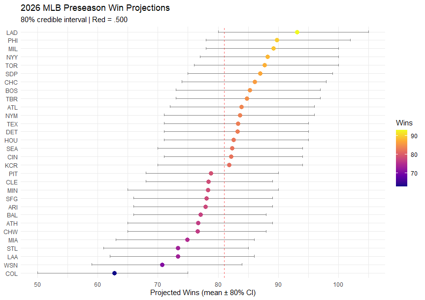
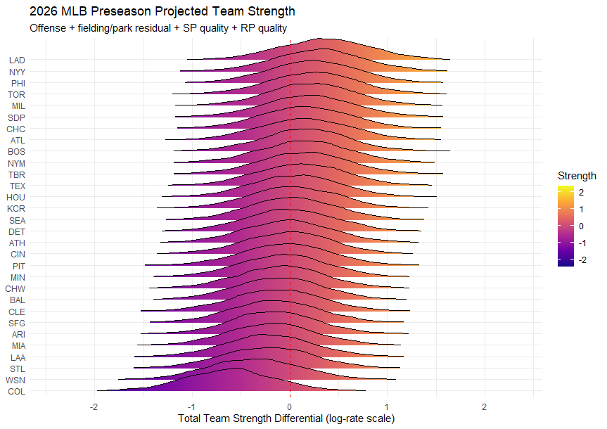

---

### Overview

This project extends the [2025 Bayesian Scoring Model](https://ryanliam-bio.github.io/baseball_analytics/projects/bayesian-mcmc/) into a full preseason projection system for the 2026 MLB season. Rather than treating team strength as unknown and fitting from scratch as we did previously, the 2025 Stan posterior is used directly as an informative prior, encoding what was learned from last year's fit before layering in off-season roster adjustments with projections from PECOTA.

The pipeline connects four components:

1. **Posterior-as-prior**: Shrink 2025 Stan posterior toward the league mean, building a foundation from last year's analysis while acknowledging year-to-year regression
2. **PECOTA adjustment**: Blend in projected offensive and pitching quality, weighted by how much a roster has actually changed
3. **Season simulation**: Draw team strength samples and simulate all 2,430 games with game-specific starter assignment
4. **Evaluation**: Calibrate hyperparameters on 2023–2025 out-of-sample seasons; evaluate against null baseline on MAE, RMSE, Spearman rank correlation, and prediction interval coverage

---

### Key Results

**PHI, MIL, and LAD lead the 2026 projections** at 89–93 wins. NYY and TOR headline the AL at 88 wins each, while the AL Central projects tightly between 76–83 wins. Full division tables are [below](#2026-projected-win-totals).

**Out-of-sample accuracy** (2023–2025 calibration seasons, 90 team-seasons):
- **MAE: 7.51 wins** — a 21.7% improvement over the 81-win null baseline (MAE 9.32)
- **80% interval coverage: 81.1%** — near-perfect calibration against the expected 80%
- Largest misses are teams that both significantly changed their pythagorean win % YoY and over/underperformed that expectation (BAL 2023: +25 wins vs projected; CHW 2024: −28 wins)

**Methodology in plain English**: The model starts from what it learned watching every 2025 game, i.e. how well each team attacked and prevent runs across four run-event types, and how each pitcher performed; then shrinks those estimates toward the league mean to account for year-to-year regression. PECOTA projections for 2026 rosters are blended in, with more weight given to teams that changed their roster substantially. Starters are sampled game-by-game in proportion to their projected starts rather than assuming a fixed rotation, and a separate reliever adjustment updates each team's bullpen prior from 2025 rather than carrying it forward unchanged. The full 2,430-game schedule is then simulated 1,000 times to generate win total distributions.

*For the gory technical details (likelihood specification, prior math, and calibration grid) continue reading below.*

---

### Prior Construction

The 2025 Stan posterior provides team attack (`att_run_r`), defense (`def_run_r`), pitcher ability, bullpen effects, and park factors across four run-event types. Each parameter is shrunk toward zero before the PECOTA layer is applied:

$$\mu_{\text{prior}} = s \cdot \mu_{\text{posterior}}, \quad \sigma_{\text{prior}} = \sqrt{\sigma_{\text{posterior}}^2 + (1-s)^2 \cdot 0.04}$$

where $s$ is the shrinkage factor (calibrated to $s = 0.8$). This inflates uncertainty for teams whose 2025 performance may not carry forward, while retaining the directional signal.

---

### Offensive Adjustment

PECOTA projects each hitter's PA and wOBA for 2026. The team-level offensive signal is computed as a log-rate adjustment relative to the 2025 league average runs-per-team baseline:

$$\delta_{\text{off}} = \log\!\left(\bar{R}_{2025} + \sum_i \text{PA}_i \cdot \frac{\text{wOBA}_i - \bar{\text{wOBA}}}{\text{wOBA\_scale}}\right) - \log(\bar{R}_{2025})$$

This measures offensive quality as a rate departure from the prior year's empirical baseline, avoiding the need for per-player historical comparisons.

#### Roster Continuity Weighting

One of the major design questions was how much weight the PECOTA signal should receive versus the 2025 posterior. For a team that returns 90% of its lineup, the posterior already encodes most of what matters and PECOTA adds limited incremental information. For a team that turned over half its roster, PECOTA should be the primary signal. The exact balance is more art than science at this point, but I settled comfortably on the formula below after playing with a few different weighting structures.

Let $c$ be the fraction of projected 2026 PA contributed by players who were on the same team in 2025 (roster continuity). Then:

$$w_{\text{attack}} = 0.15 + 0.85 \cdot (1 - c)$$

At $c = 1.0$ (fully returning roster), PECOTA receives 15% weight- allowing a small correction for regression and projected development. At $c = 0.0$ (entirely new roster), PECOTA receives 100% weight as the posterior carries no information about this lineup. Historical continuity data (2021–2025) shows that MLB teams typically fall between $c = 0.50$ and $c = 0.87$, placing most teams in the 0.22–0.56 PECOTA weight range.

---

### Pitching Adjustment

Perhaps the most notable upgrade over our 2025 model is the explicit separation of team run prevention between starters and relief pitchers. The Stan model jointly estimates three distinct run-prevention parameters: `pitcher_ability` (individual starter quality), `bullpen_effect` (team reliever quality), and `def_run` (residual fielding and park effects after both pitching components are controlled). Each receives a separate PECOTA signal routed to the parameter it actually represents.

**Individual starter priors**: For pitchers with a 2025 posterior estimate, the Stan posterior mean is shrunk toward zero and overlaid with PECOTA DRA− where available. For new pitchers with no 2025 data, a K-BB% adjusted prior is derived from PECOTA projections. Pitchers with fewer than 5 projected starts are excluded from the starter pool.

**Bullpen adjustment**: Reliever quality is updated using a reliever-only (gs < 5) IP-weighted DRA− signal applied directly to the `bullpen_effect` prior:

$$\delta_{\text{bp}} = \log\!\left(\frac{\text{DRA}^-_{\text{RP,proj}}}{100}\right)$$

This was absent in earlier model versions, leaving bullpen priors anchored entirely to 2025 posteriors with no projection update.

**Fielding residual**: `def_run` receives a small PECOTA DRA− signal (weight = 0.10) as a weak regularizer, but is primarily governed by the shrunk 2025 posterior. Because `def_run` represents what remains of run prevention *after* individual SP and bullpen effects are extracted, applying heavy team-total DRA− to this parameter would double-count pitcher quality already captured elsewhere.

---

### Season Simulation

The preseason posterior is constructed by sampling from the prior distributions:

$$\text{att}_r^{(d)}, \text{def}_r^{(d)} \sim \mathcal{N}(\mu_r, \sigma_r), \quad d = 1, \ldots, 4000$$

Each sample is row-centered to enforce the sum-to-zero constraint from the Stan model's transformed parameters block. Individual game win probabilities are simulated using the same Dixon-Coles Negative Binomial / Poisson structure as the 2025 model.

#### GS-Proportional Rotation Sampling

A key improvement over naive team-average pitcher assignment is game-specific starter sampling. Each team's rotation is represented as a pool of eligible starters, where each pitcher's sampling probability is proportional to their PECOTA projected games started:

$$P(\text{pitcher } p \text{ starts game } g) = \frac{\text{GS}_p}{\sum_{p' \in \text{team}} \text{GS}_{p'}}$$

This naturally handles 6-man rotations (the 6th starter accumulates their projected share of games) and injury-risk aces (a pitcher projected for 22 GS rather than 30 due to injury risk starts ~22/162 of games, not 1/5). All starter assignments are pre-sampled as an $N_{\text{sim}} \times N_{\text{games}}$ integer matrix before the simulation loop for efficiency.

For individual game queries, actual MLBAM pitcher IDs can be supplied directly to `simulate_game()`, bypassing the rotation sampling.

---

### 2026 Projected Win Totals

The model simulates the full 2,430-game schedule 1,000 times, drawing a fresh posterior sample each iteration.

*Projected 2026 win totals with 80% CI.*

> **Note on mean-reversion:** Strong 2025 teams are pulled toward the mean by design; teams that heavily upgraded their rosters may appear conservative. The in-season update pipeline is the intended correction mechanism as 2026 results accumulate.

**American League**

<table style="border-collapse:collapse; font-size:0.95em">
<thead>
  <tr>
    <th colspan="2" style="text-align:center; padding:6px 14px; border:1px solid #555">AL East</th>
    <th style="width:20px; border:none; background:transparent"></th>
    <th colspan="2" style="text-align:center; padding:6px 14px; border:1px solid #555">AL Central</th>
    <th style="width:20px; border:none; background:transparent"></th>
    <th colspan="2" style="text-align:center; padding:6px 14px; border:1px solid #555">AL West</th>
  </tr>
  <tr>
    <th style="padding:4px 14px; border:1px solid #555">Team</th>
    <th style="padding:4px 14px; border:1px solid #555">Proj W</th>
    <th style="border:none; background:transparent"></th>
    <th style="padding:4px 14px; border:1px solid #555">Team</th>
    <th style="padding:4px 14px; border:1px solid #555">Proj W</th>
    <th style="border:none; background:transparent"></th>
    <th style="padding:4px 14px; border:1px solid #555">Team</th>
    <th style="padding:4px 14px; border:1px solid #555">Proj W</th>
  </tr>
</thead>
<tbody>
  <tr>
    <td style="padding:4px 14px; border:1px solid #444">NYY</td>
    <td style="padding:4px 14px; border:1px solid #444">88.2</td>
    <td style="border:none"></td>
    <td style="padding:4px 14px; border:1px solid #444">DET</td>
    <td style="padding:4px 14px; border:1px solid #444">83.2</td>
    <td style="border:none"></td>
    <td style="padding:4px 14px; border:1px solid #444">TEX</td>
    <td style="padding:4px 14px; border:1px solid #444">83.3</td>
  </tr>
  <tr>
    <td style="padding:4px 14px; border:1px solid #444">TOR</td>
    <td style="padding:4px 14px; border:1px solid #444">87.7</td>
    <td style="border:none"></td>
    <td style="padding:4px 14px; border:1px solid #444">KCR</td>
    <td style="padding:4px 14px; border:1px solid #444">81.8</td>
    <td style="border:none"></td>
    <td style="padding:4px 14px; border:1px solid #444">HOU</td>
    <td style="padding:4px 14px; border:1px solid #444">82.6</td>
  </tr>
  <tr>
    <td style="padding:4px 14px; border:1px solid #444">BOS</td>
    <td style="padding:4px 14px; border:1px solid #444">85.3</td>
    <td style="border:none"></td>
    <td style="padding:4px 14px; border:1px solid #444">CLE</td>
    <td style="padding:4px 14px; border:1px solid #444">78.4</td>
    <td style="border:none"></td>
    <td style="padding:4px 14px; border:1px solid #444">SEA</td>
    <td style="padding:4px 14px; border:1px solid #444">82.3</td>
  </tr>
  <tr>
    <td style="padding:4px 14px; border:1px solid #444">TBR</td>
    <td style="padding:4px 14px; border:1px solid #444">84.8</td>
    <td style="border:none"></td>
    <td style="padding:4px 14px; border:1px solid #444">MIN</td>
    <td style="padding:4px 14px; border:1px solid #444">78.3</td>
    <td style="border:none"></td>
    <td style="padding:4px 14px; border:1px solid #444">ATH</td>
    <td style="padding:4px 14px; border:1px solid #444">76.7</td>
  </tr>
  <tr>
    <td style="padding:4px 14px; border:1px solid #444">BAL</td>
    <td style="padding:4px 14px; border:1px solid #444">77.1</td>
    <td style="border:none"></td>
    <td style="padding:4px 14px; border:1px solid #444">CHW</td>
    <td style="padding:4px 14px; border:1px solid #444">76.6</td>
    <td style="border:none"></td>
    <td style="padding:4px 14px; border:1px solid #444">LAA</td>
    <td style="padding:4px 14px; border:1px solid #444">73.3</td>
  </tr>
</tbody>
</table>

**National League**

<table style="border-collapse:collapse; font-size:0.95em">
<thead>
  <tr>
    <th colspan="2" style="text-align:center; padding:6px 14px; border:1px solid #555">NL East</th>
    <th style="width:20px; border:none; background:transparent"></th>
    <th colspan="2" style="text-align:center; padding:6px 14px; border:1px solid #555">NL Central</th>
    <th style="width:20px; border:none; background:transparent"></th>
    <th colspan="2" style="text-align:center; padding:6px 14px; border:1px solid #555">NL West</th>
  </tr>
  <tr>
    <th style="padding:4px 14px; border:1px solid #555">Team</th>
    <th style="padding:4px 14px; border:1px solid #555">Proj W</th>
    <th style="border:none; background:transparent"></th>
    <th style="padding:4px 14px; border:1px solid #555">Team</th>
    <th style="padding:4px 14px; border:1px solid #555">Proj W</th>
    <th style="border:none; background:transparent"></th>
    <th style="padding:4px 14px; border:1px solid #555">Team</th>
    <th style="padding:4px 14px; border:1px solid #555">Proj W</th>
  </tr>
</thead>
<tbody>
  <tr>
    <td style="padding:4px 14px; border:1px solid #444">PHI</td>
    <td style="padding:4px 14px; border:1px solid #444">89.8</td>
    <td style="border:none"></td>
    <td style="padding:4px 14px; border:1px solid #444">MIL</td>
    <td style="padding:4px 14px; border:1px solid #444">89.2</td>
    <td style="border:none"></td>
    <td style="padding:4px 14px; border:1px solid #444">LAD</td>
    <td style="padding:4px 14px; border:1px solid #444">93.1</td>
  </tr>
  <tr>
    <td style="padding:4px 14px; border:1px solid #444">ATL</td>
    <td style="padding:4px 14px; border:1px solid #444">83.9</td>
    <td style="border:none"></td>
    <td style="padding:4px 14px; border:1px solid #444">CHC</td>
    <td style="padding:4px 14px; border:1px solid #444">86.1</td>
    <td style="border:none"></td>
    <td style="padding:4px 14px; border:1px solid #444">SDP</td>
    <td style="padding:4px 14px; border:1px solid #444">87.0</td>
  </tr>
  <tr>
    <td style="padding:4px 14px; border:1px solid #444">NYM</td>
    <td style="padding:4px 14px; border:1px solid #444">83.6</td>
    <td style="border:none"></td>
    <td style="padding:4px 14px; border:1px solid #444">CIN</td>
    <td style="padding:4px 14px; border:1px solid #444">82.2</td>
    <td style="border:none"></td>
    <td style="padding:4px 14px; border:1px solid #444">SFG</td>
    <td style="padding:4px 14px; border:1px solid #444">78.1</td>
  </tr>
  <tr>
    <td style="padding:4px 14px; border:1px solid #444">MIA</td>
    <td style="padding:4px 14px; border:1px solid #444">74.9</td>
    <td style="border:none"></td>
    <td style="padding:4px 14px; border:1px solid #444">PIT</td>
    <td style="padding:4px 14px; border:1px solid #444">78.8</td>
    <td style="border:none"></td>
    <td style="padding:4px 14px; border:1px solid #444">ARI</td>
    <td style="padding:4px 14px; border:1px solid #444">77.9</td>
  </tr>
  <tr>
    <td style="padding:4px 14px; border:1px solid #444">WSN</td>
    <td style="padding:4px 14px; border:1px solid #444">70.7</td>
    <td style="border:none"></td>
    <td style="padding:4px 14px; border:1px solid #444">STL</td>
    <td style="padding:4px 14px; border:1px solid #444">73.3</td>
    <td style="border:none"></td>
    <td style="padding:4px 14px; border:1px solid #444">COL</td>
    <td style="padding:4px 14px; border:1px solid #444">62.8</td>
  </tr>
</tbody>
</table>

*Preseason posterior distributions of overall team strength (attack − defense) across all run types, ordered by posterior mean.*

---

### Model Evaluation

Hyperparameters were calibrated using a grid search across 3 out-of-sample seasons (2023, 2024, 2025), where each year's Stan posterior was fit independently on that year's data with no forward leakage. The scoring target is mean Pythagorean RMSE across all three calibration years; Pythagorean wins filter one-run-game luck that the model cannot and should not explain.

**Optimal hyperparameters:** shrinkage = 0.80, attack_weight = 0.10, defense_weight = 0.10, bullpen_weight = 0.35, pitcher_mean_weight = 0.50

#### Pooled Out-of-Sample Performance (2023–2025, 90 team-seasons)

|                  | RMSE      | MAE       | Spearman ρ | Pearson r |
|------------------|-----------|-----------|------------|-----------|
| Null (81 wins)   | 12.23 wins | 9.32 wins | —          | —         |
| Model            | 9.57 wins  | 7.51 wins | 0.548      | 0.627     |

**21.7% RMSE improvement over the null baseline.** Model bias is +0.16 wins, effectively zero systematic over- or under-projection.

**Prediction interval coverage:**
- 80% interval (q10–q90): 73/90 team-seasons = **81.1%** (expected 80%) | near-perfect calibration
- 50% interval (q25–q75): 49/90 team-seasons = **54.4%** (expected 50%) | within the ±8pp margin at n=90

#### Calibration Curve

| Predicted bucket | n  | Mean predicted | Mean actual | Bias  |
|------------------|----|----------------|-------------|-------|
| <70              | 3  | 65.5           | 57.3        | +8.2  |
| 70–73            | 11 | 71.0           | 71.0        |  0.0  |
| 74–77            | 11 | 75.4           | 70.4        | +5.0  |
| 78–81            | 19 | 79.5           | 81.9        | −2.4  |
| 82–85            | 16 | 83.5           | 88.5        | −5.0  |
| 86–89            | 20 | 86.5           | 84.2        | +2.3  |
| 90–93            | 8  | 91.2           | 90.4        | +0.8  |
| 94+              | 2  | 95.1           | 91.0        | +4.1  |

The 82–85 bucket shows mild negative bias (−5 wins) as the flip side of our 74-77 bucket's +5 win positive bias, which is largely expected with our posterior shrinkage compressing slightly above- and below- average teams toward the mean. The <70 and 94+ buckets contain only 3 and 2 team-seasons respectively, not enough for calibration inference.

As previously mentioned, the largest individual misses across all three calibration years were dramatic organizational turnarounds who simultaneously beat expectations, good or bad: BAL 2023 (projected 76, actual 101), CHW 2024 (projected 69, actual 41), ATH 2023 (projected 73, actual 50). These are largely systematic unknowns- collective breakout or collapse years driven by development, injury, or organizational factors invisible at Opening Day.

#### Important Caveats on Evaluation

With only 3 calibration years (90 team-seasons), conclusions carry meaningful uncertainty:

- **MAE / Spearman**: Reliable for detecting differences larger than ~0.5 wins or ~0.05 in ρ
- **Calibration curve**: ~15 data points per win bucket; directionally informative, not statistically definitive
- **Coverage**: 90 binary outcomes; 95% CI on coverage proportion is approximately ±8 percentage points
- **Year effects**: The 2023 pitch clock and shift ban introduced a structural break; the model cannot separate this from genuine prediction error
- A minimum of 10 seasons would be needed to make strong calibration claims
- **MAE vs RMSE optimization**: The grid search was also run targeting MAE as an alternative loss function. The two targets produced identical optimal parameters, and at high-fidelity evaluation (500 simulations) win projections differed by less than 1 win for virtually every team. The final production model uses MAE-optimal parameters, but the choice of loss function is inconsequential given the available calibration data.

---

### Limitations

**Team-level offense modeling**: The offensive adjustment aggregates all projected PA at the team level. This treats a team adding a +4 WAR outfielder identically to a team with +4 WAR spread across six marginal upgrades. I'll be following this up with a full scale player-level model.

**Fielding signal**: The `def_run` prior represents the residual run prevention not explained by individual starters or the bullpen, primarily fielding quality and park factor interactions. It receives only a weak PECOTA regularization (weight = 0.10) because no reliable preseason fielding metric (OAA, DRS) is yet integrated at the team level. Teams with significant defensive overhauls in the offseason may be systematically over- or under-projected until an explicit fielding adjustment is added. 

**Bullpen transitions**: Mid-season roster changes are not modeled. The preseason model is a snapshot as of Opening Day rosters.

**No in-season updating**: The model is static. An in-season Bayesian update pipeline (daily posterior re-estimation from game results) is the intended next development phase.

**Calibration sample size**: Three calibration years represent the limit of available Stan posteriors. Hyperparameter uncertainty is non-trivial.

---

### Technical Notes

- **Software**: R 4.4, rstan, tidyverse, baseballr
- **Prior source**: Stan posterior from ~2,400 verified 2025 regular-season games
- **Projection source**: PECOTA 2026 (March 20 snapshot), depth-chart-only players
- **Simulation**: 1,000 season draws × 2,430 games; GS-proportional starter pools pre-sampled as $N_{\text{sim}} \times N_{\text{games}}$ matrix
- **Calibration**: Grid search over shrinkage ∈ {0.7, 0.8}, attack_weight ∈ {0.1–0.4}, defense_weight ∈ {0.00–0.15}, bullpen_weight ∈ {0.15–0.45}, pitcher_mean_weight ∈ {0.0–0.5}; 200 simulations × 3 years per grid point; pitcher_mean_weight refined via targeted sweep to 0.50
- **Schedule**: Retrieved via `baseballr::mlb_schedule(season = 2026)`

---

*This project builds directly on the [2025 Bayesian Scoring Model](https://ryanliam-bio.github.io/baseball_analytics/projects/bayesian-mcmc/). The 2025 Stan model and full methodology are documented there.*
