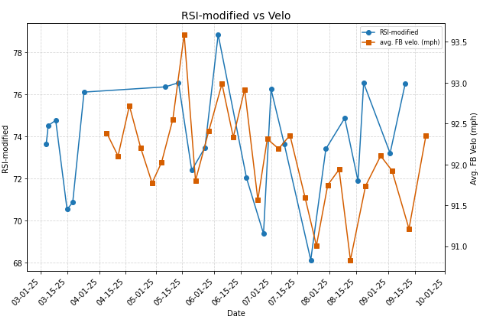
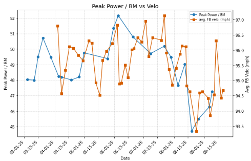
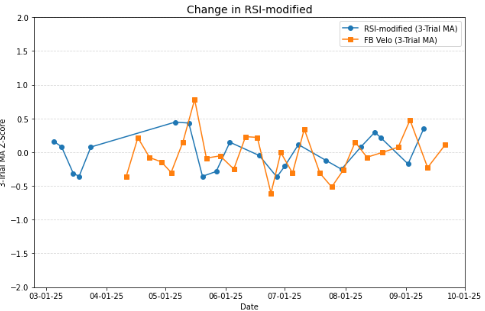
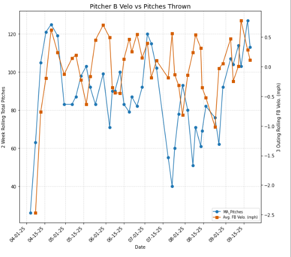

### Project Resources
Access the full dataset and analysis scripts used in this study:

<a href="pitchdata.csv" download>📥 Download Raw Pitch Data (CSV)</a>

<a href="jumpdata.csv" download>📥 Download Raw Jump Testing Data (CSV)</a>

<a href="Jump+Pitch Data.ipynb" download="Force-Plate-Pitching-Correlation.ipynb" class="btn btn-primary">
  📥 Download Python Notebook
</a>

In late October '25 I had the opportunity to work with a small pitch velo and jump testing data set for a pair of sample pitchers. 
I spent the better part of a week writing up an exhaustive report detailing the relation (or lack thereof) between 
their jump testing output and their pitch velocity. 
Having spent the last few years so heavily entrenched in the world of force plates
and pursuing baseball analytics on the side, this proved to be exactly the kind of investigation
that gets me out of bed in the morning.

The jump set had a standard full array of force plate data outputs and I opted to focus on
peak power/BM, RSI-mod, jump height, and eccentric braking RFD as the most familiar from my work.
As shown below, there was a fair relationship between different jump performance metrics
and pitch velo for both pitchers, though Pitcher B's outputs were much more volatile across the board.
It's important to note that Pitcher B was a reliever, averaging 27 pitches per outing, 
and Pitcher A was a starter, averaging 62 per outing. 

  

    
    
<em>Fig 3: Pitcher A RSI-mod vs Velo</em>

  

  

    
    
<em>Fig 4: Pitcher B PP/BM vs Velo</em>

  

From there, I took a look at % change over time for each metric and pitcher, Z-Score change,
and finally 3-trial moving average Z-Score trend. For pitcher A in particular, this 3-trial 
average showed a pretty strong relationship between our jump metrics and pitch velocity.
The increased variance in Pitcher B's outputs is not surprising given his role but 
I found a better relationship simply between 2-week total pitches thrown rolling average
and velo than any of the jump metrics. 

  

    
    
<em>Fig 1: Pitcher A 3-trial RSI-mod Moving Average vs Velo</em>

  

  

    
    
<em>Fig 2: Pitcher B 2-week rolling total pitches vs Velo</em>

  

This data set left much to be desired. There were multiple trials misclassified as Player A
with incongruous body weight measurements, there is a massive gap in the jump data for Pitcher A
from mid-March to early May, and I would have strongly preferred to see asymmetry data available.
However, I believe this was manufactured to be imperfect and the opportunity to explore
intersectional relationships like this was incredibly fulfilling. 