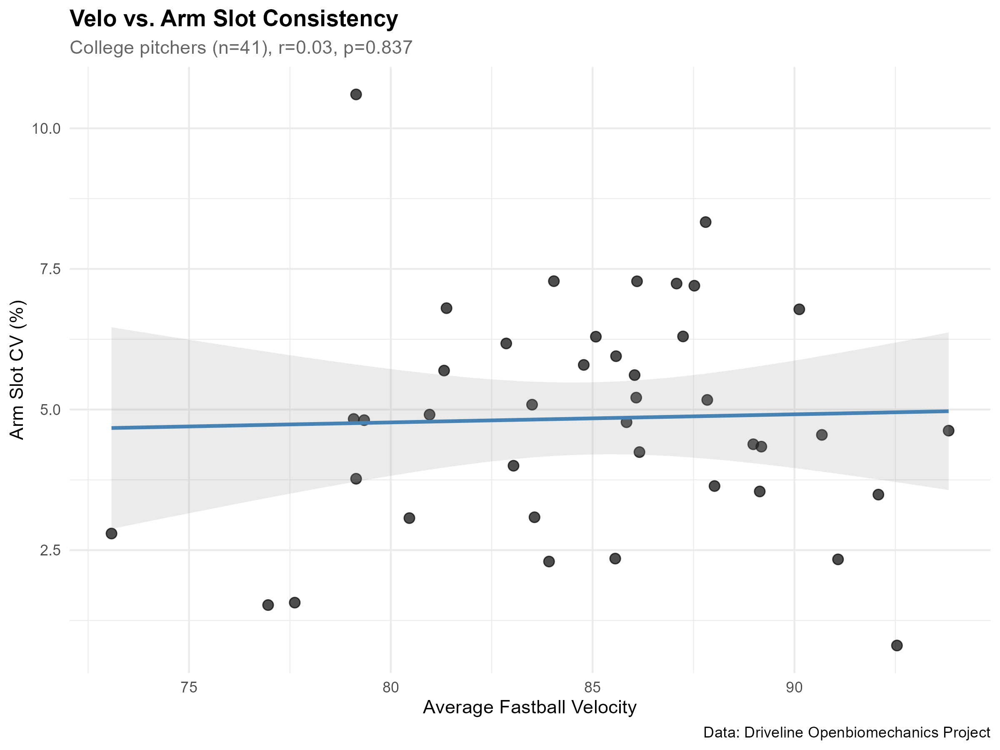

<a href="analysis.R" download class="btn btn-primary">
Download Analysis Script (R)
</a>

---

> [!abstract] Summary
> This is an **exploratory analysis** designed to demonstrate a methodological approach- not to draw definitive conclusions. With only 41 college pitchers (~5 pitches each) and as few as 6 in the top velocity tier, sample sizes are insufficient for robust statistical inference. The patterns observed here are descriptive only and would require validation with larger datasets.

## Motivation

"Repeatability" is frequently cited in pitching development conversations, but it's rarely quantified. This analysis uses the [Driveline OpenBiomechanics Project](https://github.com/drivelineresearch/openbiomechanics) to explore:

1. How consistent are college pitchers mechanically, pitch-to-pitch?
2. Is there a relationship between fastball velocity and mechanical repeatability?
3. Which biomechanical metrics show the most/least variation?

The focus here is on consistency itself- not command outcomes or injury correlations, which would require different datasets. This analysis was partially inspired by Driveline's stellar work exploring [how biomechanical markers relate to command.](https://sabr.org/analytics/presentations/2025)

---

## Data

The OpenBiomechanics Project provides marker-based motion capture data from pitchers assessed at Driveline Baseball.

**Full sample composition:**
| Playing Level | n |
|---------------|---|
| College | 75 |
| High School | 5 |
| Independent | 4 |
| MiLB | 2 |

High school pitchers averaged ~10 mph below MiLB arms, making cross-level comparisons problematic. This analysis **filters to college pitchers with 5+ fastballs per session**, resulting in the final analytical sample of 41 pitchers.

---

## Methods

### Quantifying Consistency

Mechanical consistency is measured via **coefficient of variation (CV)**:

$$CV = \frac{\sigma}{\mu} \times 100$$

Lower CV indicates tighter repeatability. For metrics that can be negative (e.g., trunk lateral tilt), raw standard deviation is used instead.

### Metrics Analyzed

| Category | Metric | Measure |
|----------|--------|---------|
| Release position | Arm slot | CV |
| Release position | Trunk lateral tilt at release | SD |
| Separation | Hip-shoulder separation | CV |
| Lower half | Stride length | CV |
| Rotational | Pelvis rotational velocity | CV |

### Composite Mechanical CV

For pitcher profiling, a composite mechanical CV was calculated by averaging four metrics:
- Arm slot CV
- Stride length CV
- Hip-shoulder separation CV
- Pelvis rotational velocity CV

Trunk tilt was excluded from the composite because it uses SD (different scale than CV).

### Velocity Tiers

Pitchers were grouped by mean fastball velocity:

| Tier | Velocity Range |
|------|----------------|
| 1 | 90+ mph |
| 2 | 86-90 mph |
| 3 | 82-86 mph |
| 4 | < 82 mph |

---

## Results

### Velocity vs. Arm Slot Consistency

Correlation between fastball velocity and arm slot CV: **r = 0.033, p = 0.837**. At the individual pitcher level, there is essentially no linear relationship between velocity and arm slot consistency.

### Tier Comparison

| Tier | n | Mean Velo | Mean CV (Arm Slot) | 95% CI |
|------|---|-----------|-------------------|--------|
| 90+ mph | 6 | 91.7 | 3.76 | [2.11, 5.41] |
| 86-90 mph | 13 | 87.5 | 5.58 | [4.73, 6.43] |
| 82-86 mph | 11 | 84.3 | 4.83 | [3.83, 5.83] |
| < 82 mph | 11 | 79.0 | 4.58 | [3.05, 6.11] |

The 90+ mph tier shows the lowest mean arm slot CV (3.76%), while the 86-90 mph tier shows the highest (5.58%). However, confidence intervals overlap substantially across all tiers, and sample sizes are far too low to draw meaningful conclusions.

### Full Biomechanical Summary by Tier

| Tier | n | Arm Slot CV | Trunk Tilt SD | Hip-Shoulder CV | Stride CV | Pelvis Rot CV | Composite CV |
|------|---|-------------|---------------|-----------------|-----------|---------------|--------------|
| 90+ mph | 6 | 3.76 | 1.03 | 3.42 | 1.30 | 3.52 | **3.00** |
| 86-90 mph | 13 | 5.58 | 1.49 | 3.11 | 1.82 | 4.00 | 3.63 |
| 82-86 mph | 11 | 4.83 | 1.34 | 3.17 | 1.52 | 4.50 | 3.51 |
| < 82 mph | 11 | 4.58 | 1.84 | 4.70 | 2.14 | 3.34 | 3.69 |

*Composite CV = average of Arm Slot, Hip-Shoulder, Stride, and Pelvis Rot CVs (excludes Trunk Tilt SD due to different scale)*

**Observed patterns** (descriptive only; not statistically validated):
- The 90+ mph tier shows the lowest variability in trunk tilt (SD = 1.03°) and stride length (CV = 1.30%)
  - Composite CV for this group was noticeably lower than any other. Further exploration of this pattern is desired with a more sufficient dataset.
- The < 82 mph tier shows notably higher hip-shoulder separation variability (CV = 4.70%) compared to other tiers

### Pitcher Profiles

Using quartile rankings for both velocity and composite mechanical CV, pitchers were classified:

| Profile | Description | n |
|---------|-------------|---|
| Elite | Top quartile velo + top quartile consistency | 6 |
| Plus Velo / Plus Consistency | Top quartile velo, 2nd quartile consistency | 3 |
| Volatile Arm | Top quartile velo, bottom half consistency | 2 |
| Above Average | 2nd quartile velo, top half consistency | 2 |
| Consistent / Minus Velo | Bottom half velo, top quartile consistency | 4 |
| Average | Middle of distribution | 21 |
| Needs Development | Bottom quartile in both | 3 |

The majority of pitchers (21 of 41) fall into the "Average" category, as expected with quartile-based classification. Six pitchers met the criteria for "Elite" status: top quartile in both velocity and mechanical consistency.

---

## Limitations

**Sample constraints:**
- ~5 pitches per pitcher limits the precision of CV estimates; each pitcher's "consistency" score has high uncertainty
- 41 pitchers split across 4 velocity tiers yields 6-13 per group, too few for reliable group comparisons
- Driveline's sample is self-selected; these are pitchers who sought out biomechanical assessment, likely not representative of all college pitchers

**Scope constraints:**
- Single-session data; no longitudinal tracking to assess consistency changes over time
- Fastballs only; breaking ball consistency may differ
- No outcome data (command, whiff rate) to validate whether consistency matters for performance

**What this analysis demonstrates:**
- A reproducible methodology for quantifying mechanical consistency
- SQL-based biomechanical data pipeline construction
- Framework for hypothesis generation in future studies with adequate sample sizes

**What it cannot support:**
- Causal claims ("velocity causes consistency")
- Generalization to all college pitchers
- Statistically validated conclusions

---

## Technical Implementation

Full pipeline in downloadable R script: SQL (CTEs, window functions, JOINs) → R (correlation, visualization).

---

## Source

Data from the [Driveline OpenBiomechanics Project](https://github.com/drivelineresearch/openbiomechanics), a public repository of pitching biomechanics data.
