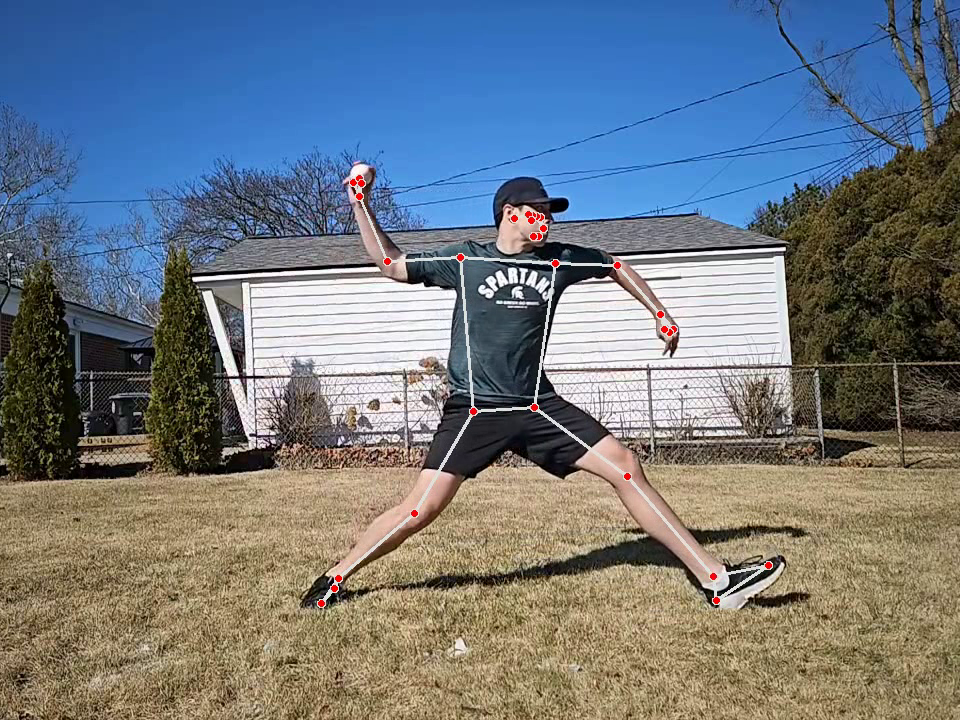
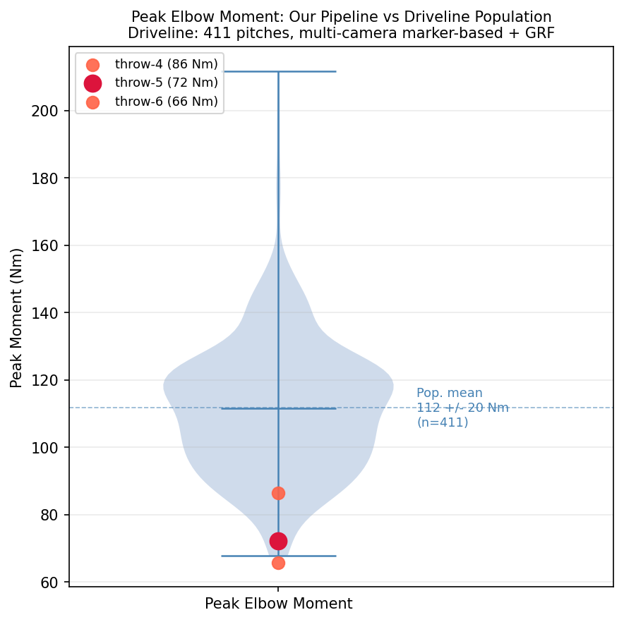
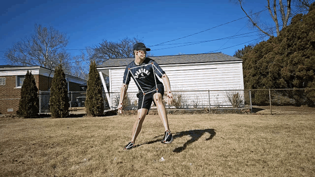

## Overview

This project builds a markerless pitching biomechanics pipeline from scratch, targeting the core workflow used in full-scale mocap systems: video → pose estimation → inverse kinematics → inverse dynamics → joint moment analysis.

The goal was not to produce a clean result. It becomes clear quickly throughout this project how many limitations exist in single camera analysis, but rather than process existing public footage I opted to collect data firsthand. This decision served several purposes; first, it meant designing the pipeline from capture setup to joint moment output and producing an honest account of where each phase breaks down, rather than inheriting decisions made upstream. This effort also gave me a brief glimpse into the challenges faced by every member of the acquisition process - participant, system operator, and analyst alike.

---

## Pipeline Architecture

| Phase | Input | Process | Output |
|-------|-------|---------|--------|
| 1 | MP4 video | MediaPipe pose estimation | 33 body landmarks × frame |
| 2 | Raw landmarks | 4th-order zero-phase Butterworth, 6 Hz cutoff | Smoothed landmark trajectories |
| 3 | Filtered landmarks | Coordinate transform + anthropometric scaling | OpenSim-format .trc marker file |
| 4 | .trc markers | OpenSim Inverse Kinematics (Rajagopal2015 model) | Joint angle trajectories (.mot) |
| 5 | Joint angles | OpenSim Inverse Dynamics | Joint moment time series (.sto) |
| 6 | Moments + IK | Event detection, population comparison | Figures, annotated video |

Each phase is implemented as a standalone Python module, developed interactively with intermediate outputs inspected at each step.

---

## Subject 1 - Sidearm Delivery (Proof of Concept)

The pipeline was first validated on a clip from the Driveline OpenBiomechanics dataset: a left-handed pitcher throwing with a sidearm/submarine delivery at ~200fps.

**Result:** Peak elbow flexion moment = **441.6 N·m** (3.9× population mean of 111.7 N·m)

The most likely explanation is single-camera depth. The z-axis is an ML estimate only; depth-dependent DOFs are unreliable, and small errors in landmark position compound through double-differentiation into large moment values. The sidearm delivery may have contributed further, as the Rajagopal2015 model is built around overhand mechanics and an arm position this far outside that range will stress the coordinate frame assumptions. Both factors point in the same direction.

**Takeaway:** Applying overhand population norms to a sidearm throw is the wrong benchmark regardless of the moment value. Published norms (50-120 N·m) are derived from overhand pitchers; a different delivery style likely requires its own reference.

---

## Subject 2 - Conventional Overhand (Multi-Trial Analysis)

Six trials of a right-handed conventional overhand delivery were processed to assess repeatability and isolate error sources. All trials were recorded at 120fps and exported as 4× slow-motion video.

### Results by Trial

<table>
<thead><tr><th>Trial</th><th>Peak Elbow Moment</th><th>Timing vs MER</th><th>Primary error source</th></tr></thead>
<tbody>
<tr><td style="white-space:nowrap">throw-1</td><td>159.5 N·m</td><td>Pre-release</td><td>Camera drift, wide delivery window</td></tr>
<tr><td style="white-space:nowrap">throw-2</td><td>256.0 N·m</td><td>N/A</td><td>Multiple IK instabilities throughout delivery window, cumulative double-differentiation artifact</td></tr>
<tr><td style="white-space:nowrap">throw-3</td><td>49.8 N·m</td><td>N/A</td><td>Scattered tracking dropouts suppress IK output, forearm flip attenuated</td></tr>
<tr><td style="white-space:nowrap">throw-4</td><td>86.4 N·m</td><td>At MER</td><td>Forearm flip landmark ambiguity</td></tr>
<tr><td style="white-space:nowrap">throw-5</td><td>72.2 N·m</td><td>Pre-MER</td><td>Forearm flip artifact (most repeatable)</td></tr>
<tr><td style="white-space:nowrap">throw-6</td><td>65.8 N·m</td><td>540ms pre-MER</td><td>Wind-up phase in delivery window</td></tr>
</tbody>
</table>

Population mean (Driveline, 411 conventional pitches): **111.7 ± 20.2 N·m**



### The Forearm Flip Problem

The most valuable finding came from inspecting the moment time series for throws 4 and 5. The reported peak (~72-87 N·m) exists for approximately **65 milliseconds** and coincides with the forearm's rapid rotation from below to above the elbow at MER- a position change that is ambiguous from a single lateral-view camera.

Inverse dynamics computes moments from the second derivative of position. A landmark that shifts abruptly due to tracking ambiguity produces a brief, large numerical spike instead of a sustained loading signal. Sustained elbow moment values throughout the rest of the delivery are 2-8 N·m.

```
t=13.009s:  +19.9 N·m  (forearm flipping)
t=13.017s:  +22.9 N·m
t=13.058s:  -44.6 N·m  (sign flips)
t=13.075s:  -72.2 N·m  <- abs peak
t=13.141s:   -1.2 N·m  (back to baseline, 66ms later)
```

The forearm flip at MER is our fundamental bottleneck. At the moment of peak valgus loading, the forearm rotates rapidly through the camera plane. This position change is ambiguous from any single lateral view regardless of frame rate and the resulting spike in the ID output is a depth artifact, not a true loading signal.

This roadblock is not unique to this pipeline, it is a fundamental consequence of using single-camera data to drive inverse dynamics. The same artifact would likely appear in any markerless system without explicit forearm rotation handling.


---

## Annotated Video

A skeleton overlay was produced for the most repeatable trial (throw-5), tracking the kinematic chain in real time with MER and BR event detection.



Even in one of the cleaner trials, a foot landmark offset can be seen near ball release, where the marker sits significantly behind the actual foot position. The cast shadow on the grass behind the foot is the likely cause; MediaPipe places the landmark at one edge of the shadow rather than on the foot itself. This is a known single-camera limitation, one that showed in multiple trials, and a good illustration of why lower extremity kinematics from this setup are not reliable.

---

## Key Learnings

**1. Delivery window selection is the single most impactful parameter.**
Including even one second of follow-through doubles the reported peak via double-differentiation of decelerating landmarks. All trials required careful frame-by-frame inspection to set accurate windows.

**2. Tracking dropouts corrupt IK even outside the delivery window.**
Frames where MediaPipe loses detection are filled with zeroed landmark positions before IK. Scattered dropouts throughout the video pull the IK solution toward near-zero joint angles, suppressing the real signal. Throw-3's attenuated result (49.8 N·m) reflects this: the elbow trajectory stays near zero throughout the delivery, never producing a forearm flip event for ID to differentiate. Scale estimation is also affected- it runs on the full video, so dropouts outside the delivery window still degrade coordinate accuracy.

**3. The forearm flip is an unsolved problem for single-camera ID.**
Elbow landmark position is unclear when the forearm rotates rapidly through the camera plane. This produces the largest artifact in the ID output and coincides exactly with peak valgus torque, which is unfortunately also the value we're generally most interested in.

**4. OpenSim's coordinate assumptions embed delivery-style priors.**
The Rajagopal2015 model expects markers in orientations consistent with overhand throwing. Sidearm mechanics violate these assumptions systematically, producing artifacts that cannot be corrected in post-processing.

---

## Possible Next Steps

Each limitation in this pipeline has a clearly actionable next step that could meaningfully reduce the error:

| Limitation | Next step |
|------------|-----------|
| Single-camera depth ambiguity | Add a second synchronized camera at ~90 degrees- even an uncalibrated pair would clarify the forearm flip |
| Forearm orientation at MER | 240fps capture improves temporal resolution through the flip window, reducing the double-differentiation spike and allowing for higher filter cutoff |
| No ground reaction forces | Add two force plates to capture ground reaction forces throughout the full delivery and enable lower extremity moment estimation|
| Landmark tracking in shadows | Controlled lighting to eliminate hard cast shadows; the full-body shadow behind the pitcher degrades background separation throughout the delivery, not just at MER |
| Delivery window manual selection | Automated event detection from wrist velocity peak and elbow extension rate |
| Scale estimation with one camera | Static calibration frame at the start of each clip; pitcher stands in T-pose at known distance |

---

**Stack:** Python 3.10 · MediaPipe 0.10 · OpenSim 4.5 · OpenCV · SciPy · Pandas
**Data:** Driveline OpenBiomechanics dataset (411 pitches) for population reference; original smartphone video for subjects
