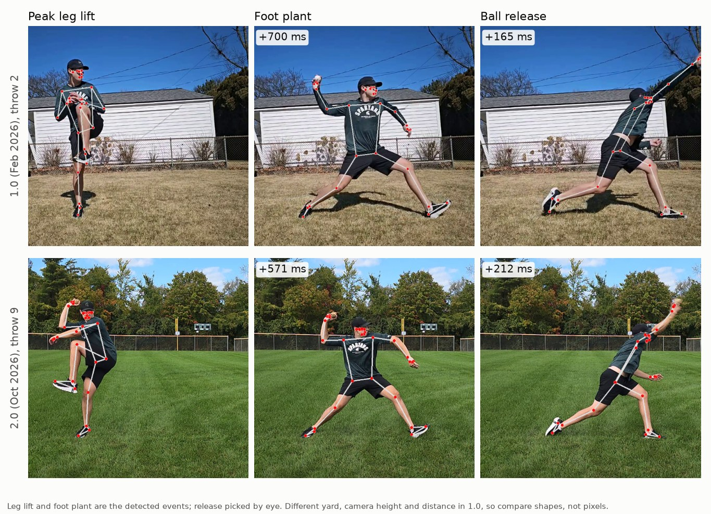
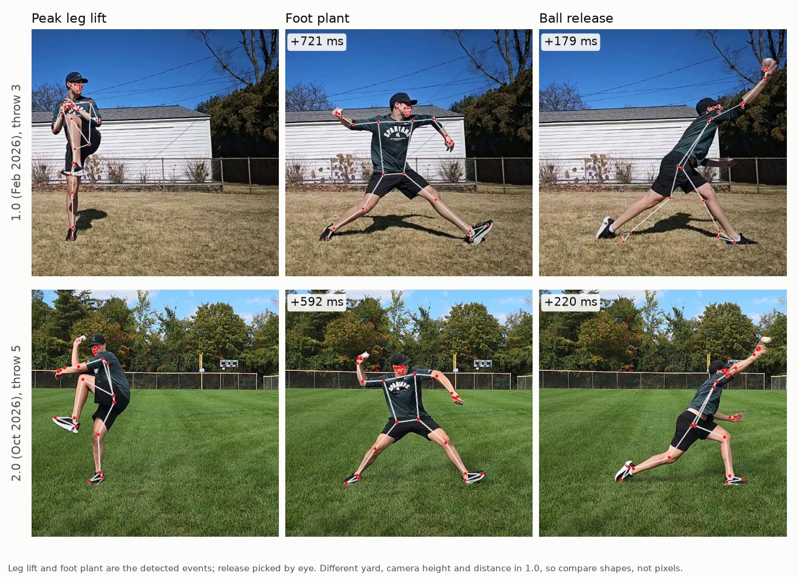

> [!abstract] Summary
> This page started in February as Markerless pipeline 1.0: phone video of me throwing, taken all the way through OpenSim inverse dynamics.
> Since then, I've reworked my motion and improved the acquisition setup, but coming back to analyze ~20 new throws revealed a number of issues in the initial effort.
> The clips were slowed down **8x, not the 4x previously believed**, so 1.0's kinetics ran on a clock way too slow, and the elbow torque I compared to Driveline used an entirely different definition. So the 1.0 torque 
> numbers are retired. 2.0 rebuilds the front end for two synced phones (coming soon, original February 2-phone attempt had acquisition issues) and starts with a solo session re-scored 
> like-for-like against the 1.0 throws. There remains very little real analysis to draw thanks to the inherent limitations of a single phone camera setup,
> but we can at least quantify one concrete difference: I get from peak leg lift to foot plant about 60 ms faster as a result of drifting into 
> my stride rather than balancing squarely on my back leg.

### Overview

If you looked at the original throws and thought, "that must be one of those nerds ruining baseball", that's more or less how I felt watching it back myself.
Being 10 years removed from playing has done no favors to my coordination! Thankfully, I've had the chance to work with a local pitching center over the last few months as I've geared
up for a triumphant return via Metro Detroit 30+ baseball. Side note, it's pretty awesome to experience the other side of the curtain again
as I try to apply what I've learned about analytics, performance science, coaching, etc. in these last few years to my own development.

1.0 was the whole chain from one Samsung on a tripod: MediaPipe pose estimation, a Butterworth filter, a scaled OpenSim model, inverse kinematics,
inverse dynamics, and a peak elbow moment compared against Driveline's OpenBiomechanics pitchers. The main conclusion was that a single camera can't 
resolve peak elbow torque, mostly because of the forearm flipping through the camera plane right at max external rotation.

Before adding the second camera I wanted a cleaner baseline, so this first 2.0 session is one phone utilizing the same side view as 1.0 for 22 full-effort throws. 
I also upgraded from a foam board with plain checkerboard to 1/2in MDF with ChArUco board, as the spray adhesive warped the panels problematically 
in my first try at 2-phone sync back in February. Re-scoring the 1.0 throws next to these is how I found most of what's below. 

---

### What 1.0 Got Wrong

Some of this is the single camera. Most of it is structural issues that stemmed from slow-motion factoring mismatches.

**The clock was off by 8x.** The 1.0 clips were Samsung slow-motion files, stored as 30 fps playback. I'd assumed 120 fps capture slowed 4x, 
but the pipeline didn't even apply that (it ran IK and ID on the slowed file timeline). When I re-scored 1.0 at 4x, every interval came out 
exactly double today's (leg lift to foot plant, foot plant to release), and the ball on throw 4 crossed the frame at under 30 mph. At 8x (240 fps capture, 
same as my phone today) both line up. That means 1.0's inverse dynamics saw velocities 8x too low and accelerations 64x too low, so the dynamic 
part of every joint moment was ~64x too small. The "6 Hz" filter was really a 48 Hz filter. The 72 N·m peak I wrote about was a leftover artifact sitting 
on top of all that.

**I compared the wrong elbow moment.** OpenSim's `elbow_flex` moment is flexion/extension. Driveline's elbow number (`elbow_moment_y`) is 
varus/valgus, the one that loads the UCL. The model's elbow is a hinge with no varus axis at all, so ID can never output that number directly. 
It has to come from the elbow's net joint moment.

**The marker file had problems of its own.** Only 12 markers (no heel or toe markers in the .trc, so foot plant was guesswork), detection dropouts filled with zeros 
(the hip midpoint, which drags IK toward nonsense), and a mirror image in depth because I flipped MediaPipe's y-axis without its z-axis.

The 1.0 headline (one camera can't resolve peak elbow torque) still holds but the numbers attached to it certainly don't, so this update replaces the 1.0 write-up rather than patching it.

---

### What's New in 2.0

The new front end swaps one camera for two synchronized phones and passes OpenSim the same `.trc` marker file:

- **Calibration:** a 7×5 ChArUco board (107 mm squares on MDF, updated from foam board) gives each phone's lens model, then where the two phones sit relative to each other
- **Sync:** a clap gets the two clips within a few frames, then the geometry between the cameras refines it to under a millisecond (0–0.5 ms on simulated captures)
- **Triangulation:** markers in real meters, with depth measured instead of guessed by MediaPipe
- **Events:** foot plant, max external rotation, and release are found automatically, along with the window to read peaks from

I also added guardrails for everything that made 1.0 such a tough hang. 2.0 won't treat a slow-motion file as real time without flagging it,
will flag dropped frames that land inside a delivery (my S26 sometimes drops 4 frames/~17 ms at a time), and reports how well the lens calibration
actually captures the focal length. This session's lens sweep fit great on paper (0.27 px error) but left about 1% uncertainty in focal length, 
so I'll ensure better coverage for 2.1.

---

### Solo Baseline: 1.0 vs 2.0

To make the comparison line up, both sessions go through identical processing- the same MediaPipe model 1.0 used, the same frame rate (every frame of the new 
240 fps clips, matching 1.0's 240 fps captures), real time, and one scale from my standing height. The single POV can't properly measure depth, so the 
comparison sticks to what we can analyze with some confidence (stride, front knee, trunk tilt, and timing between events).

Three of the new throws had foot plant detected in the wrong frame and the last two were thrown with a glove on (1.0 was bare-handed), so that leaves 17 throws against the 6 from 1.0.

| Metric | 1.0 (n=6) | 2.0 (n=17) | Change [95% CI] | Read |
| --- | --- | --- | --- | --- |
| Peak leg lift → foot plant | 692 ms | 634 ms | −57 [−105, −9] | **Faster** |
| Foot plant → release | 176 ms | 190 ms | +13 [−13, +39] | No clear change |
| Stride (% of height) | 75.2 | 71.6 | −3.7 [−15.3, +8.0] | No clear change |
| Front knee flexion at foot plant | 16.0° | 22.0° | +6.0 [−7.2, +19.3] | No clear change |
| Front knee flexion at release | 28.1° | 41.0° | +12.9 [−9.3, +35.1] | No clear change |
| Trunk forward tilt at foot plant | −1.6° | −6.8° | −5.2 [−7.8, −2.5] | Within camera error |
| Trunk forward tilt at release | 27.9° | 24.9° | −3.0 [−6.2, +0.2] | No clear change |

Our one real takeaway is the tempo change. Trunk tilt at foot plant clears zero statistically (if anything I'm a little *less* 
tilted toward the plate now), but ~5° is pretty much exactly the size of error we'd expect from moving the camera so I'm not reading into it (or stride length) much.
Part of the foundational intent in my reworked delivery is more trunk tilt but I felt (and saw, after the fact) myself "pulling up" when my 
timing was off earlier in the motion.

One thing that shows up in both sessions is my front knee keeps bending after foot plant (12–19° more by release) instead of blocking properly.
Gotta get back in the lab to figure that out. 

#### Typical vs Typical

These are the throws closest to each session's medians. A few things to note:
- Obviously, my hands break much earlier as my arm is already in position by the time I get to peak leg lift. It's a bit of a work in progress, 
but keeping that hand cocked (but relaxed) next to my head and keeping my elbow directly in front of my shoulder has been pivotal in keeping the 
stress off my bicep since I strained it in June. 
- There's a much stronger emphasis on rotating inwards and keeping those hips/shoulders held in until I'm almost at foot plant. This is the real
driving force behind the shorter time between peak leg lift and foot plant, as you can clearly see I'm already striding forward when my leg begins to dip
where before I was effectively just balancing on my back leg. That additional rotation has enabled me to build velocity more smoothly, but I 
tend to plant a little early (right of the plate line) and get a little crossfire at times. 
  - I'm hesitant to really compare against Driveline's data, but this tempo improvement of 692->634 ms between peak leg lift and foot plant would take me from bottom quartile (slow) to about average tempo. This has no relationship with velocity per the OBP data but provides helpful context for the shift. 
- It doesn't show as cleanly here, but initially I found myself pushing straight off my toe as I stride. Pushing off the heel and rolling that up
the foot helps with sequencing and generally smooths out my landing.
- While improved, one of my weak points right now is keeping the front elbow up and ripping it down as I rotate. I still have some lingering
inclination to just get the front shoulder out of the way rather than completing that kinetic chain.

#### Best vs Best

Typical is the fair comparison, but I wanted to show each session at its best. For 2.0 that's easy as we were able to roughly calculate velocity 
and throw 5 represented my peak around 76 mph. 1.0 is harder because the ball was only trackable once, so we used peak wrist speed as a very rough
proxy. I was hoping to put some numbers to my improvement, either from a velocity perspective or a movement perspective, but the data quality in
1.0 was disappointingly lacking, to put it mildly.

Same story as the typical throws: hand up early, drifting into stride before the leg drops, rotational focus. 
Also worth noting 1.0's skeleton at release- the legs cross over each other, the result of a left/right swap MediaPipe 
made constantly in the 1.0 footage.

---

### What's Next: 2.1

- **Second phone** behind the pitcher on the arm side, ideally both at 240 fps (the iPhone only does 240 in stock Slo-mo; if it ends up at 120, the pipeline handles the mix), so the forearm at max external rotation is seen from two very different angles
- **Calibration redo:** lens sweeps at 1.5–3 m with the board tilted 30–45° and pushed into the frame corners, plus board holds that both phones can see
- **Back to OpenSim:** scale the model from a 3D T-pose, run IK over the whole clip, and get elbow varus the right way, compared to Driveline at their 20 Hz filter
- **Error check:** the same throws scored from one phone alone and from both, which tells me how wrong single-camera numbers like 1.0's actually were

---

### Limitations

Basically everything. It's really not worth trying real analysis on single camera captures.

Single-camera depth is a guess, so nothing that depends on it (pelvis/trunk rotation, max external rotation, arm slot) is compared here. The camera positions differ between sessions (different yard, height and distance in 1.0, and 1.0 throw 4 from another spot), so angles and stride carry a few degrees or percent of camera bias that can't be separated from mechanics. 1.0 only has 6 throws, which is why most of the intervals are wide. The "best" 1.0 throw rests on a proxy that explains under half the variation in ball speed, so treat it as one of 1.0's better throws rather than *the* best.

The 8x conclusion comes from event timing and ball physics. The original 1.0 videos are gone, so there's no file metadata to confirm. Release is detected from peak wrist speed, which misses actual release by different amounts in the two sessions (~20 ms early on the 2.0 throws I checked, anywhere from ~10 ms early to ~30 ms late on the 1.0 footage), so foot plant → release differences under ~30 ms aren't resolvable. Peak leg lift sits on a plateau (the knee hangs at the top), so its timing on a single throw can move by up to ~50 ms with small tracking changes. The averages are stable (−57 ms whether the new clips run at 120 or 240 fps). Throws were excluded from what the video showed at the event frames, never from their metric values.

---

### Technical Notes

- **Software:** Python 3.11, MediaPipe 0.10.14 (legacy Pose, complexity 1, same as 1.0), OpenCV 4.11 (ChArUco), PyAV, NumPy, SciPy, pandas, matplotlib. OpenSim 4.5 comes back in 2.1.
- **Capture:** Galaxy S26 Ultra Slow motion mode, 1080p, 240 fps stored as 8x slowed 30 fps; 22 throws on Oct 2, 2026. 1.0: Galaxy S23 Ultra, 720p, 240 fps / 8x, 6 throws (Feb 2026).
- **Pose:** every frame of the 240 fps clips, matching 1.0's 240 fps captures, since legacy MediaPipe smooths frame-to-frame
- **Scale and axes:** nose-to-ankle = 87% of my height (6'3") while set before throwing, from Winter's anthropometric tables (1.0 used 94%, which ignored ankle height); fixed origin; depth zeroed, so in-plane metrics only
- **Filtering:** 4th-order zero-lag Butterworth at 12 Hz for both sessions (1.0 re-filtered from its raw landmarks)
- **Events:** peak leg lift = peak lead knee height; foot plant = lead heel/toe within 2.5 cm of its planted height; release = peak wrist speed
- **Stats:** Welch 95% confidence intervals, change = 2.0 minus 1.0
- **Velocity:** ball found over ~15 frames after release as a straight-line, constant-speed track (RANSAC); speed = ball-widths per frame × 73.7 mm × 240 fps, using the session-median ball size (19 px) since every throw went to the same target. Image-plane speed only, so roughly ±3-4 mph per throw; throw 3 checked by hand (69 mph both ways).
- **Best throws:** 2.0 by ball speed. 1.0 by peak wrist speed, picked as the proxy before testing it: across the 20 tracked 2.0 throws it correlates with ball speed at r = 0.64 (95% CI 0.41–0.81). 1.0 throw 1 skipped for a wrist tracking jump at release.
- **Time-scale check:** the same ball-as-ruler speed on 1.0 throw 4, plus 1.0 event intervals vs 2.0's
- **Calibration:** 7×5 ChArUco, 107.0 mm squares (measured; both diagonals match a true rectangle), lens error 0.27 px, focal length ±1.1%

<!-- TODO: code zip link, like Bat Speed 3.0 -->

 

<em>Questions, comments, etc. welcome- just message me.</em>

