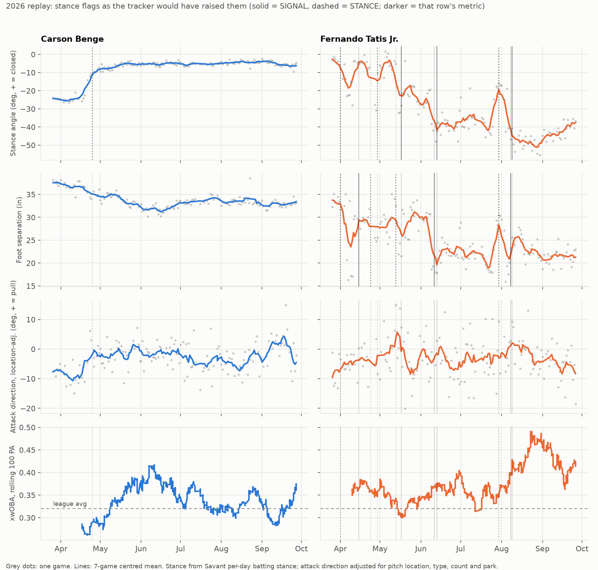

> [!abstract] Summary
> Hoping to find early signs of hitter performance changes in progress, I built a tracker that flags in-season stance and swing changes using 
Savant's daily batting stance data and tested on 2024-26 to see if any of it is actually worth acting on. Largely, it's not. The tracker catches 
changes quickly (**Carson Benge**'s closed stance was flagged within four days), but showed that few changes are followed by better results 
than we'd expect from natural variance. The clearest exception that held up: hitters who **narrowed their stance 4.5+ inches** beat their projection 
by ~9 points of xwOBA the rest of the way, which is about 10 percentile spots among everyday hitters. Stance changers whose swing traits shifted toward a 
higher-damage profile (mostly added bat speed) beat it by ~16 and generally did so without adding whiffs. Neither makes for a great forecast on any 
one hitter, so the tracker works best as a reference log when figuring out where a hot streak came from.

### Overview

Stance changes are one of the easiest causes to point to when a struggling player turns their season around. **Fernando Tatis Jr.** came into the 
2026 season with his least open stance in years and his results were below average for the first two months (.310 wOBA through May). While his .347 xwOBA indicates
there was some tough luck in there, it was also the lowest 2-month Pull-Air% of his career so it's not surprising to see underperformance in that department.
Mercifully, he opened back up 20+ degrees and narrowed his feet ~6 inches in June, and was one of the best hitters in baseball from then on. 
**Carson Benge** closed his stance in late April and was a significantly better hitter the rest of the way. If you can spot changes 
like these before the hitter really heats up, that seems to be a pretty big edge.

The problem is that these two stuck out because they worked. What we actually want to know is how often a hitter changes his stance and doesn't 
find it to be the cure-all for his offensive woes.

Savant's [batting stance page](https://baseballsavant.mlb.com/visuals/batting-stance) only shows season and monthly averages, but it turns out 
the CSV export takes any date range you want, down to a single day. So I pulled one stance reading per hitter per game for 2024-26 (stance angle, 
distance between the feet, depth in the box, and distance off the plate) and paired it with the swing-level bat tracking from 
[Bat Speed Analysis 3.0](https://ryanliam-bio.github.io/baseball_analytics/projects/bat-speed-three/).

---

### How the Tracker Works

**Adjust before comparing.** About half of a hitter's swing-to-swing variation in attack direction is just where he was pitched, so every
swing metric gets adjusted, within each hitter, for pitch location, pitch type, velo, movement, count, platoon, and ballpark before anything is compared.

**Separate noise from change.** For each hitter and metric, the tracker finds the most likely change date
and flags it when the shift is both statistically clear (fewer than 1 in 100 seasons with no real change would trip it) and big enough to care about. 
The size bar does most of the work- stance is measured so precisely that the statistical test alone flags a bunch of 2-5 degree tweaks.

**Check stance daily.** A single game's stance angle is accurate to about ±2 degrees, so a big change shows up within 3 games. 
Checking daily cut the median delay between batter change and system flag from 14 days to 5.

Thresholds were set on 2024-25, then tested by replaying 2026 one day at a time with only the data available on each date.
It also compares the first five weeks of each season to the end of the last one to catch offseason changes.

| Change | Flagged at |
| ------------------------------------------- | ---------------------------- |
| Stance angle (open/closed) | 12°+ |
| Distance between feet | 4.5+ in |
| Distance off plate / depth in box | 2+ in / 3+ in |
| Bat speed | 2+ mph |
| Attack direction / contact depth | 6° / 3.5 in |
| Attack angle / swing path tilt | 4.5° / 2.5° |

---

### Benge and Tatis

*Grey dots are single games, lines are 7-game averages. Vertical lines are stance flags as the tracker would have raised them in real time- solid for the change types that historically came with better-than-projected hitting (below), dashed for everything else.*

Benge is the clean case that gave me hope this would be easy. His stance angle went from −24 to −12 degrees (negative = open) the week of April 20 and 
kept closing to about −5 by June, and the tracker flags it April 25. He was sitting at a .288 xwOBA when the flag went up and hit .349 
the rest of the way, 39 points above what he'd have projected for at that point (according to a generous league-average baseline).

| Benge, 2026 | Before Apr 21 (70 PA) | After (579 PA) | League |
| ----------------- | --------------------- | -------------- | ------ |
| xwOBA | .264 | .351 | .315 |
| K% | 25.7% | 21.4% | 22.3% |
| Exit Velo | 89.4 | 88.6 | 88.3 |
| Launch Angle | 6.7° | 12.7° | 13.7° |
| GB% | 51% | 42% | 43% |
| Pull Air% | 6.7% | 14.8% | 18.6% |
| xwOBAcon | .302 | .415 | .362 |

I wouldn't put much stock in a hitter's first 70 Major League plate appearances, but the swing change 
is about as clear cut as it gets. Before the change, Benge had one of the flattest swings in baseball (1st percentile attack angle) and 
one of the most opposite-field attack directions (2nd percentile). Afterward he was at the 26th and 23rd percentiles. He didn't really start 
swinging harder, either. His bat speed bumped ~1.3 mph for the first few weeks (adjusted for how he was pitched), but most of that came 
from meeting the ball further out front, and it settled within about half a mph of where he started. The bigger change was where he 
made contact: his contact point moved ~3 inches further out front and he moved two inches closer to the plate, which got him more 
lift and pull even though closing a stance usually goes with less pull. My guess is that closing up helped him stay on the ball long 
enough to catch it out front instead of rolling over, but I can't prove that from this data.

Tatis was the messy case. He came into 2026 about 28 degrees more closed and 5 inches wider than he finished 2025 (the offseason check 
flags that April 1), spent most of April and May gradually shifting his stance, and arrived in June both more open and narrower than where he 
finished last year. The tracker flags him over a dozen times. His first major in-season flag (April 15, feet narrowed 8 inches) would have been a 
great one to act on: .381 xwOBA the rest of the way against a .344 projection.

---

### How Often Do Stance Changes Pay Off?

For each flag, I compared the hitter's rest-of-season xwOBA to what you'd have projected for him the day the flag went up (based on prior-season wOBA plus season-to-date xwOBA, regressed to league average), 
relative to hitters on the same day with similar playing time. First flag per hitter-season, 2024-26:

| Change | Hitters | vs Projection (xwOBA) | Beat projection by .025+ |
| ------------------------------- | ------- | --------------------- | ------------------------ |
| **Feet narrowed 4.5+ in** | 176 | **+.009** (+.005 to +.014) | **31%** (similar hitters 19%) |
| Feet widened 4.5+ in | 164 | +.003 (−.001 to +.008) | 23% (19%) |
| Opened / closed 15°+ | 24 / 31 | +.015 (+.001, +.029) / +.007 (−.007, +.021) | 33% / 19% (19%) |
| Bat speed up 2+ mph | 152 | +.007 (+.001 to +.012) | 30% (20%) |
| Other stance changes (12-15°, box position) | 533 | +.003 (+.001 to +.006) | 23% (19%) |
| Swing-only shifts (attack direction, contact depth, attack angle) | 204-313 | −.001 to +.003 (range across the three, none significant) | 19-21% (19-20%) |

*95% intervals in parentheses, resampling hitters.*

Most of these wind up pretty close to zero, and even for the best group about two in three hitters didn't beat projection by 25+ 
points. Narrowed feet is the one that held up: positive in both the seasons the thresholds were set on and the 2026 replay, still +.006 
when compared directly to other stance changers, and the only group that survives a correction for testing this many things at once. 
Opening 15+ degrees looks good but it's 24 hitters, and bat speed jumps worked in 2024-25 and did nothing in 2026.

**Why projections instead of before-and-after?** Hitters tend to change things when they're struggling, and struggling hitters usually 
bounce back on their own. By before-and-after, widening looks just as good as narrowing- the wideners were just slumping harder, 
so more of their "improvement" was regression they were getting anyway.

**Why doesn't everyone narrow their stance?** Because a narrow stance isn't actually better- across 826 hitter-seasons, 
width has basically no relationship with xwOBA. Narrowers usually start wide, and the best narrowing was going back toward the width a 
hitter used the year before, so it looks more like undoing a stance that drifted too wide than finding a better one. These are also hitters 
who *chose* to change, presumably with their hitting coaches. If it ain't broke.

---

### Does the Swing Have to Follow?

Stance changes where the swing moved in *any* direction did no better than ones with no change. So I put together what we'll 
call **swing xwOBA**: the xwOBA you'd expect only from a hitter's bat speed, attack angle, attack direction, contact point, and 
tilt, based on how those traits play across the league. I won't call it a swing grade, because it's not that robust- it just says 
whether a hitter's profile moved toward or away from the kind that usually does more damage. Then I checked which way it moved over 
the three weeks after each stance change. Percentages are based on numbers of changes (41 changes from 39 hitters).

| 3 weeks after a stance change | Hitters | vs Projection, from that point | Beat projection by .025+ | Fell short by .025+ |
| ------------------------------- | ------- | ------------------------------ | ------------------------ | ------------------- |
| **Swing xwOBA up .010+** | 39 | **+.016** (+.005 to +.026) | **41%** (similar hitters 19%) | 7% |
| Roughly flat | 230 | +.006 (+.001 to +.010) | 24% | 19% |
| Swing xwOBA down .010+ | 24 | −.004 (−.019 to +.010) | 37% | 41% |

That was positive in both 2024-25 and 2026, and the bigger the move, the bigger the edge. Benge lands in the top group, along with PCA, 
Garrett Mitchell, and Tatis. For most of these hitters the gain came from bat speed (~1.5 mph on average)- Benge's was the exception, 
mostly lift and pull. Somewhat surprisingly to me, the extra bat speed didn't come back as whiffs: hitters who added 2+ mph didn't whiff or strike out any more 
than similar hitters, and the returns were almost entirely damage on contact. Still, it's only 39 hitters, and more than half of them 
didn't beat their projection by 25+ points. The decliner group wasn't all bad, but more volatile and a smaller sample.

---

### Offseason Changes

Same idea, comparing the first five weeks of a season to a hitter's last 30 games of the previous one. The detection works- 
every hitter named in MLB.com's [April 2025 piece on stance changes](https://www.mlb.com/news/biggest-batting-stance-changes-in-2025) that 
I checked was flagged by April 6. **Cam Smith** gets logged March 31, 2026 for standing ~6 inches deeper in the box (a top-1% offseason move) 
and again April 2 for swinging 2.7 mph harder. He's also a great example of why we can't take these changes as unquestioningly positive: 
the power showed up in line with better lift and pull, but he actually dropped a few points of wOBA year over year. As a group, the ~250 
hitters a season with an offseason change big enough to log didn't beat projection.

---

### So What Are the Alerts Worth?

Frankly, not a ton. With how much a hitter's xwOBA bounces around within a season, such a small edge can get buried pretty easily and very few hitters
present as cut-and-dry an improvement as Carson Benge.

The detection side is the part that does add some value for me. It catches changes within a few days and keeps the false alarms in check, whereas most people
only see this data as monthly averages on a Savant leaderboard. Especially with the number of tinkerers like Tatis
who change their swing/stance constantly, the changes themselves just don't predict much on their own. That doesn't mean they're meaningless.

I'll be running it all next season, mostly as a reference log tracking every significant stance change, three-week swing xwOBA delta 
(likely with a more robust model), and a weekly list matching major production changes to stance/approach changes.

---

### Limitations

- Stance is one value per hitter per day, averaged over that day's swings. There's no per-pitch or per-at-bat stance in the Statcast search export, and Savant's per-day values don't come with a swing count, so I weighted each day by that hitter's tracked swings.
- Big stance angle changes are rare (24 hitters opened 15+ degrees, 31 closed 15+ across three seasons), so those rows are noisy.
- 2026 was generous to nearly every flag type for reasons I couldn't pin down, which is why I lean on comparisons between flag types rather than the raw 2026 numbers.
- The swing xwOBA split was tested after seeing the first round of results. It held up in both samples and has a clean dose-response, but 39 hitters is 39 hitters. Swing xwOBA is also a league-wide relationship- it describes which way a hitter's profile moved, not whether his swing got better for him.
- The projection is simple (prior-season wOBA plus season-to-date xwOBA, regressed to league average). Comparing to hitters with similar playing time handles its biggest bias (it under-projects regulars), but a better projection would tighten everything up.

---

### Technical Notes

- **Software:** Python 3.13, pandas, scikit-learn, statsmodels, matplotlib
- **Data:** Savant search CSV, every regular season pitch 2024-26, one day per request. Savant batting stance CSV, one day per request (~150k hitter-days)- note the `year` and `month` parameters are silently ignored; `seasonStart`, `dateStart`, and `dateEnd` are the ones that work. FanGraphs prior-season wOBA.
- **Adjustment:** gradient boosting within hitter-season on pitch location, pitch type, velocity, movement, count, platoon, and park, trained on other seasons only; league-wide seasonal trend removed. Stance box position gets a park × batter side offset.
- **Detection:** best single split since the hitter's last accepted change, flagged when |z| clears the 99th percentile of season-max |z| from no-change simulations and the shift clears the size threshold. Game-level noise model estimated from adjacent games. Stance checked daily with a 3-game minimum, swing metrics weekly. Offseason check is net of the league-wide change.
- **Outcomes:** rest-of-season xwOBA minus projection, relative to hitters on the same date in the same playing-time quintile; confidence intervals resample hitters. Control regression adds age, rookie status, season-to-date vs projection, and playing time.
- **Swing xwOBA:** weighted regression of hitter-season xwOBA (strikeouts included) on bat speed, attack angle, attack direction, contact depth, and tilt. R² of .27 on 2024-25 and .24 on 2026. Whiff check compares before vs after each flag against the same change for similar hitters.
- **Code and thresholds:** [stance-tracker-code.zip](stance-tracker-code.zip)

## TLDR

| | |
|---|---|
| **Do stance changes matter?** | Usually not. Most come with exactly the hitting you'd have projected anyway. |
| **What does?** | Narrowing the feet 4.5+ inches (+9 points of xwOBA, about 10 percentile spots), and stance changes where swing xwOBA moves up over the next three weeks (+16). Still, only ~30-40% beat their projection by much. |
| **Why did Benge work?** | He went from one of the flattest, most oppo swings in baseball to a pretty normal one. Moving contact point further out created more lift and pull, but not more bat speed. |
| **Tatis?** | A tinkerer all year who landed somewhere great. His first narrowing flag in April would've been a good call. |
| **Worth running?** | Yes, as a reference log. It's good at catching changes, not so good at predicting them. |

 

<em>Questions, comments, etc. welcome- just message me.</em>

