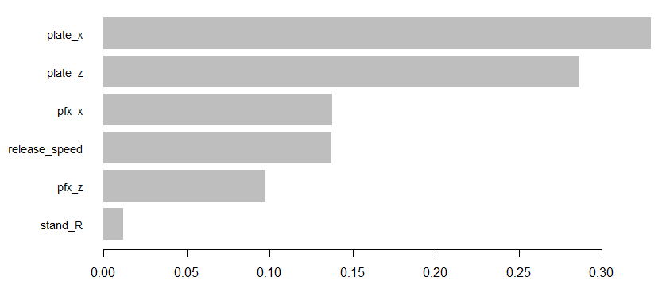

> [!abstract] Summary
> This project builds predictive models to estimate the **run value** of individual pitches based on their physical characteristics. Starting from a baseline Random Forest and iterating through feature engineering and algorithm changes, the final XGBoost model achieves a correlation of **0.152** with actual run values. Plenty of more advanced models currently exist (Stuff+, StuffPro, etc.) but I was happy to try my hand at this recent staple in pitching evaluation.

---

### Background

This project was completed as the capstone for SABR's Level Four Analytics Certification. The course materials and datasets are part of a paid certification program, so while I can't share the full datasets themselves, I'm happy to walk through the methodology and what I learned in the process.

The assignment structure was straightforward: build a baseline "Stuff" model using a specified set of pitch inputs, then improve from there. This model structure was not truly a Stuff model in the standard sense, as location was incorporated throughout and consistently showed to be the most important feature.

Stuff models have become commonplace over the last ~5 years, attempting to isolate pitch quality independent of sequencing, game context, or defensive support. At the end of the day, they ask a fairly simple question- given only the physical properties of a pitch, what run value outcome should we expect? 

My approach was iterative. After establishing the baseline Random Forest, I experimented 
with adding release extension and spin rate, expecting these to capture additional deceptive qualities. 
However, these additional variables showed inconsistent effects across runs (likely due to forest 
construction variance), so I focused on increasing num.trees from 500 to 1000, 
which provided a more reliable improvement. Finally I moved to XGBoost, which became the most predictive version after converting batter handedness into a binary feature.

---

### The Target: Run Value

Run value quantifies how much a pitch changes the expected run outcome of an at-bat. A swing-and-miss on a 3-2 count (strikeout) has strong negative run value (good for the pitcher), while a pitch crushed for a home run has strong positive run value.

The challenge is predicting this outcome using only the pitch's intrinsic qualities before the batter swings.

---

### Feature Space

The models used Statcast pitch tracking data with the following features:

| Feature | Description |
|---------|-------------|
| `release_speed` | Velocity at release (mph) |
| `pfx_x` | Horizontal movement (inches) |
| `pfx_z` | Vertical movement (inches) |
| `plate_x` | Horizontal plate location |
| `plate_z` | Vertical plate location |
| `pitch_type` | Pitch classification (FF, SL, CU, etc.) |
| `stand` | Batter handedness (L/R) |
| `release_extension` | Distance from rubber at release |
| `release_spin_rate` | Spin rate (RPM) |

The training set contained **119,424 pitches** with labeled run values; the test set contained **62,000 pitches** for evaluation.

---

### Modeling Approach

The project followed an iterative improvement process, testing hypotheses about which features and algorithms would best capture pitch quality.

#### Model 1: Baseline Random Forest

Initial model using core pitch characteristics specified in learning module:

```r
RF_stuff <- ranger(
  run_value ~ pitch_type + release_speed + pfx_x + pfx_z +
              plate_x + plate_z + home_team + stand,
  data = training_data
)
```

#### Model 2: Enhanced Random Forest

Added release extension and spin rate, hypothesizing these would capture additional signal:

```r
better_RF_stuff <- ranger(
  run_value ~ pitch_type + release_speed + pfx_x + pfx_z +
              plate_x + plate_z + home_team + stand +
              release_extension + release_spin_rate,
  data = training_data_clean,
  num.trees = 1000
)
```

Missing extension values in the test set were imputed with the training median. As previously mentioned, extension and spin rate showed negligible and inconsistent effects on run value correlation, likely as a result of their inherent expression in other pitch tracking metrics.

#### Model 3: XGBoost

Switched to gradient boosting with a simplified feature set:

```r
xg_stuff <- xgboost(
  data = xg_params,
  label = training_data_clean$run_value,
  nrounds = 100,
  max_depth = 6,
  eta = 0.1,
  objective = "reg:squarederror",
  eval_metric = "rmse"
)
```

Since XGBoost requires numeric inputs, batter handedness was converted to a binary column (`stand_R = 1` for righties, `0` for lefties) before training.

---

### Results

| Model | Features | Test Correlation |
|-------|----------|------------------|
| Baseline RF | Core + team/stand | 0.125 |
| Revised RF | + extension/spin, 500 trees | 0.120 |
| Optimized RF | -extension/spin, 1000 trees | 0.126 | 
| XGBoost (depth=8) | Core | 0.142 |
| XGBoost (depth=6) | Core + stand + ext/spin | 0.150 |
| XGBoost (depth=6) | Core | 0.151 |
| **XGBoost (depth=6)** | **Core + stand** | **0.152** |

Key findings:

1. **Batter handedness matters**: While only a marginal improvement in general, batter handedness did consistently have a positive impact on our correlation values. 

2. **Extension alone didn't help**: Despite intuition that extension would capture deception, it decreased the predictive efficacy of our models, though this was improved slightly when spin rate was also included.

3. **Simpler won**: Using only movement, speed, and location in our XGBoost model produced surprisingly effective predictions, compared to my initial expectation that including more variables would give a better overview of the data.

4. **Depth matters in XGBoost**: Increasing `max_depth` from 6 to 8 *decreased* performance (0.151 → 0.142), which likely indicates overfitting.


*Feature importance from the final XGBoost model, showing plate location as the dominant predictor.*

---

### Error Analysis

The final XGBoost model achieved:

$$\text{MAE} \approx 0.37 \text{ run value units}$$

$$\text{RMSE} \approx 0.47 \text{ run value units}$$

Training $R^2$ was consistently higher than test correlation, indicating some overfitting remains. This is to be expected given the inherent noise in pitch-level outcomes.

---

### Limitations

- **Context-free**: The model ignores count, runners, outs, and game state, all of which affect actual run value
- **No sequencing**: Pitch tunneling and setup effects are not captured
- **Single-season data**: Year-to-year variation in run environment not accounted for

---

### Technical Notes

- **Software**: R 4.2+, ranger, xgboost, tidyverse
- **Training data**: 119,424 pitches
- **Test data**: 62,000 pitches (holdout evaluation)
- **Best hyperparameters**: XGBoost with nrounds=100, max_depth=6, eta=0.1

---

### Extensions

Future iterations could explore:
- Pitcher-specific movement profiles (like [Baseball Prospectus' Arsenal Metrics](https://www.baseballprospectus.com/news/article/96026/introducing-new-arsenal-metrics/))
- Count-aware models that weight high-leverage situations
- Ensemble approaches combining RF and XGBoost predictions
