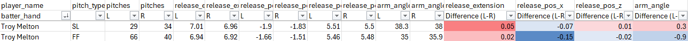

### Research Question

Do Detroit Tigers pitchers exhibit meaningful differences in release point when facing left-handed versus right-handed batters?

Understanding whether release point varies by batter handedness can help contextualize changes in pitch movement, deception, and perceived approach, particularly when only public tracking data is available.

---
A few months ago, a general question was raised regarding how one would investigate a pitcher potentially moving differently when facing LHH than RHH, resulting in a different release point. This piqued my curiosity and turned out to be a surprisingly quick and easy Savant search to enable side by side comparisons. Detroit Tigers pitchers were selected for this exercise as the roster I am most familiar with.

### Data & Approach

Using publicly available Statcast data from Baseball Savant, I compared release point metrics for Tigers pitchers when facing left-handed hitters (LHH) versus right-handed hitters (RHH).

For each pitcher and pitch type (minimum 25 pitches per pitch type per batter handedness), I examined:
- Release position (x / z)
- Extension
- Arm angle

While fastballs typically exhibit the lowest pitch-to-pitch variance, all pitch types were included given the simplicity and reproducibility of the query.

The full analysis workflow is available below:

<a href="tigers release pt.ipynb" download="Release-Points.ipynb" class="btn btn-primary">
📥 Download Full Notebook
</a>

---

### Observations

Across the pitchers examined, release point differences between LHH and RHH were generally modest. In cases where apparent separation existed, the magnitude was often small enough to warrant caution in interpretation, particularly given the lack of biomechanical context.

Without additional movement or kinematic information, it is difficult to determine whether observed differences reflect true mechanical changes or are artifacts of pitch usage, movement profiles, or sample variability. There was some indication certain release point differences (like Troy Melton's FF) may be the result of different horizontal positioning on the rubber, with a -0.15 shift in rel_pt_x but only -0.02 in rel_pt_z, but this could also be attributed to a decreased arm angle.   

For transparency, the full summary table generated by the Python workflow is available below:

<a href="rel pt diff (final).xlsx" download class="btn btn-outline-primary">
📊 Download Summary Table (Excel)
</a>

This example is not intended to draw conclusions, but rather to demonstrate how simple summaries can help flag cases where deeper biomechanical or movement-level analysis may be warranted.

---

### Limitations & Next Steps

Public tracking data provides only an indirect view of pitching mechanics. While release point can serve as a useful proxy, it cannot fully capture underlying movement strategies or delivery changes.

With access to richer datasets, future analysis would ideally:
- Integrate pitch movement/shape metrics alongside release variables
- Examine within-pitcher variability across time and workload states
- Incorporate full biomechanical marker data to distinguish mechanical changes from outcome-level proxies